《光影长青》融合高斯泼溅（Gaussian Splatting）、MetaHuman 数字人、UE5.6 渲染与动作捕捉技术，构建虚实交融的叙事影像。本文整理项目中的关键技术路径、失败尝试与最终采用的解决方案。

## 1. 高斯泼溅场景重建与导入 UE

### 数据采集

使用多角度拍摄校史馆、校园小道等实景，尽量保证光照一致性与视角覆盖，为后续高斯泼溅训练提供稳定素材。

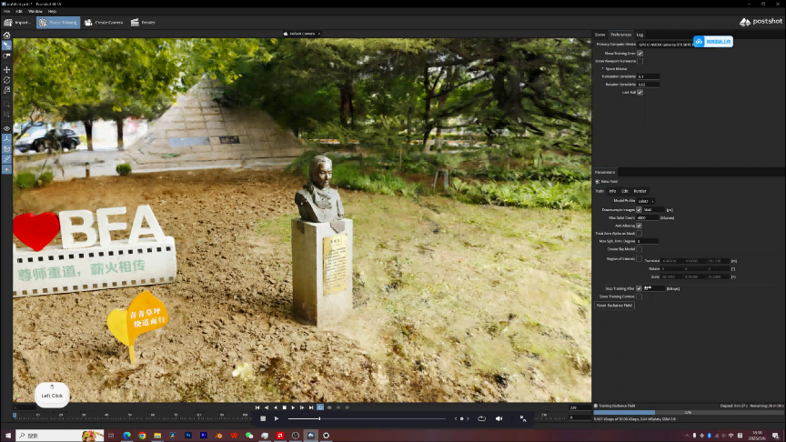

### 点云生成与处理

对比多种点云处理方案后，项目最终选定 Postshot 作为核心工具。Postshot 对动态场景支持较好，输出兼容性强，可稳定生成高质量 3D 高斯点云（`.ply` 格式），并能导入 Unreal Engine 5.6 进行实时渲染。

### 替代方案评估

项目曾尝试使用元象 XVERSE 开发的高斯泼溅 UE 插件。该插件理论上在后期光照渲染效果上优于 Postshot 生成的点云，但当时尚未适配 UE 5.6，并且无法在 NVIDIA 50 系显卡上完成模型训练。受限于兼容性，最终没有采用。

## 2. MetaHuman 角色构建与资产集成

### 面部建模探索与失败实践

项目初期尝试基于 1934 年电影《桃李劫》中陈波儿的原始影像进行三维重建，但由于年代久远、分辨率低、可用数据量不足，无法生成有效拓扑与纹理，建模失败。

随后，项目尝试使用 ComfyUI 结合 Flux Kontext 生成多角度陈波儿 AI 图像，用于辅助建模。虽然这一路径可以产出风格化肖像，但细节失真、结构不稳定，尤其在侧脸与动态表情上严重偏离真实人物特征，无法满足高精度 MetaHuman 输入要求。

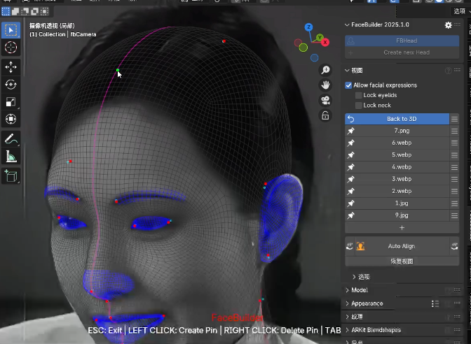

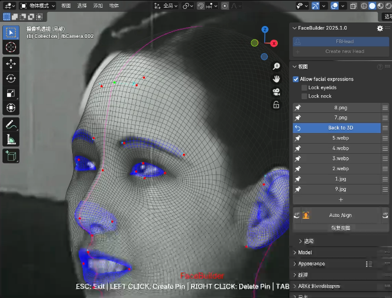

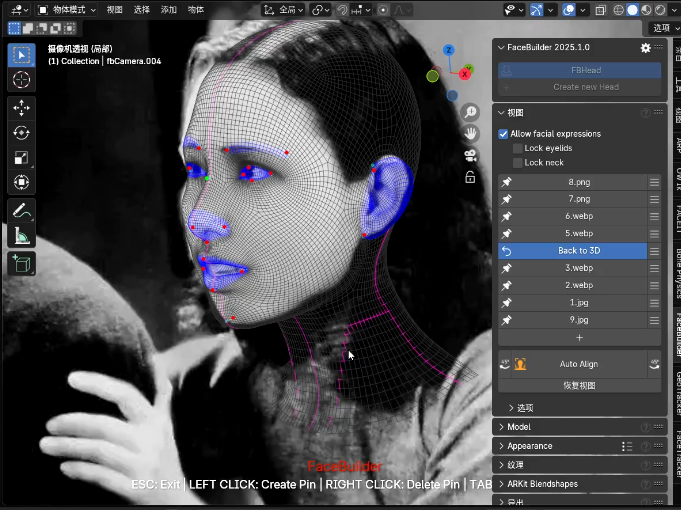

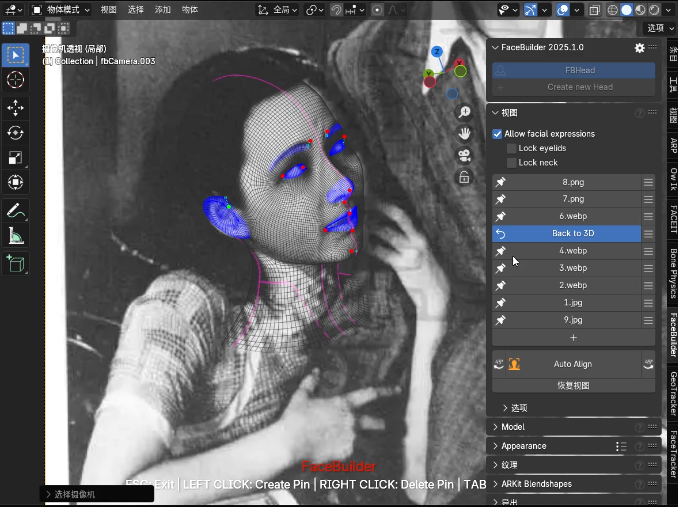

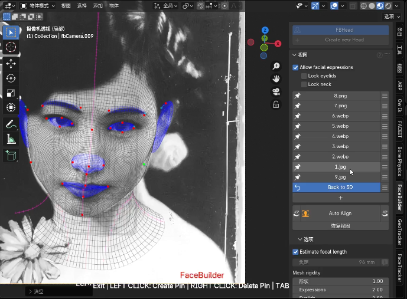

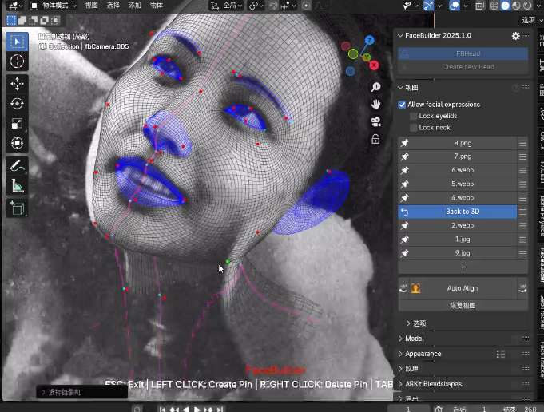

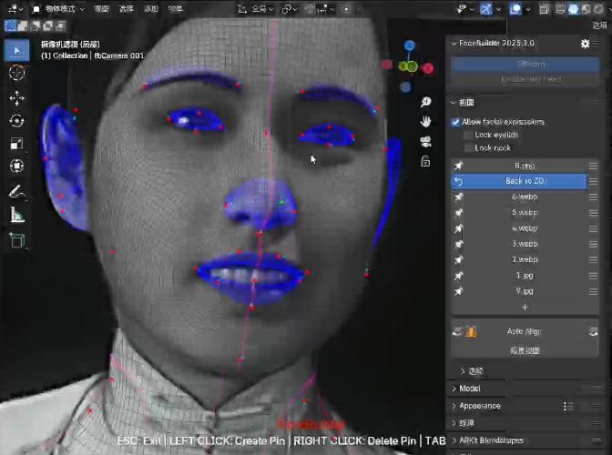

所有自动化与 AI 辅助建模方案均未达到预期，最终回归传统方式：基于历史照片、文献资料与人物纪录片，在 MetaHuman Creator 中逐项调整面部骨骼、肌肉系统与皮肤材质，实现更接近人物气质的数字形象。

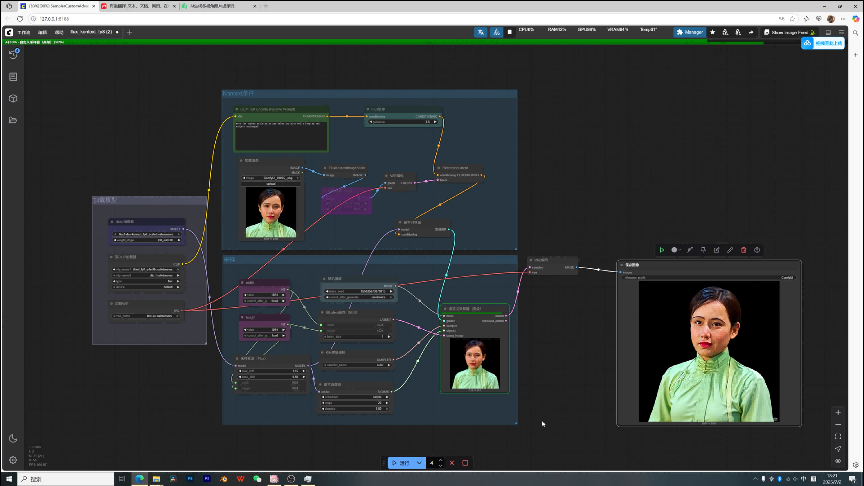

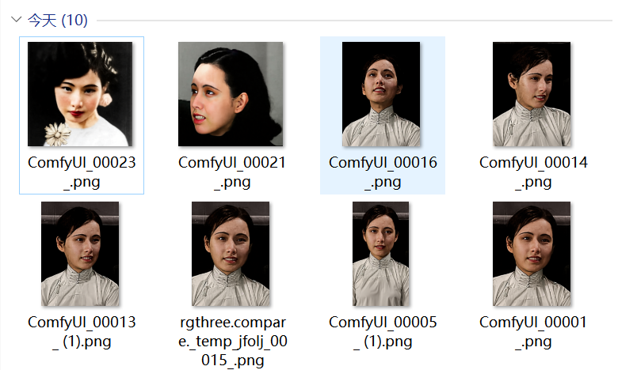

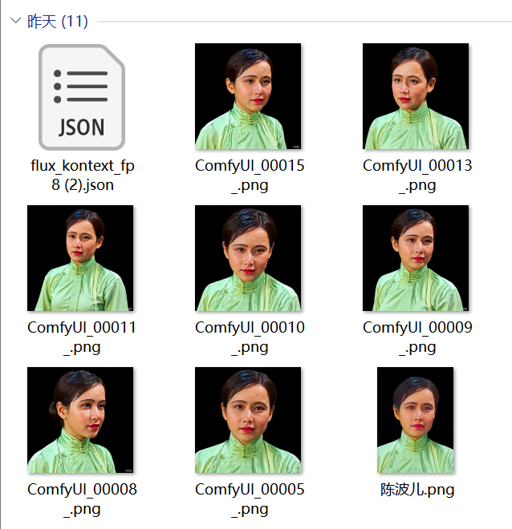

### 毛发系统

毛发使用 Blender 制作 Groom，并以 Alembic 格式通过自定义工作流导入 UE，绑定至 MetaHuman 头部。

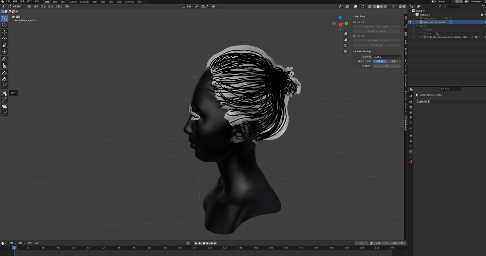

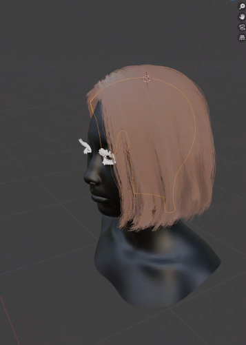

### 服装制作

服装采用第三方服装资产，经 Blender 处理后导入 UE 并转换为 Cloth Assets。由于 UE 5.6 调整了 MetaHuman 资产整合机制，组装过程中会出现异常报错，无法直接合并。

最终采用“蓝图重绑定”方案：先将服装白模与角色绑定，再通过 Control Rig 重定向，在蓝图中重新赋予布料与毛发。

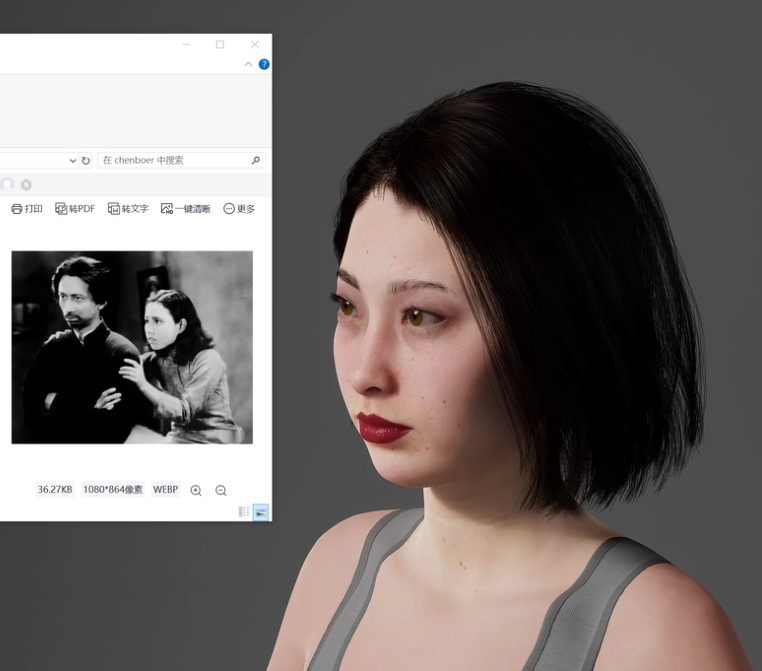

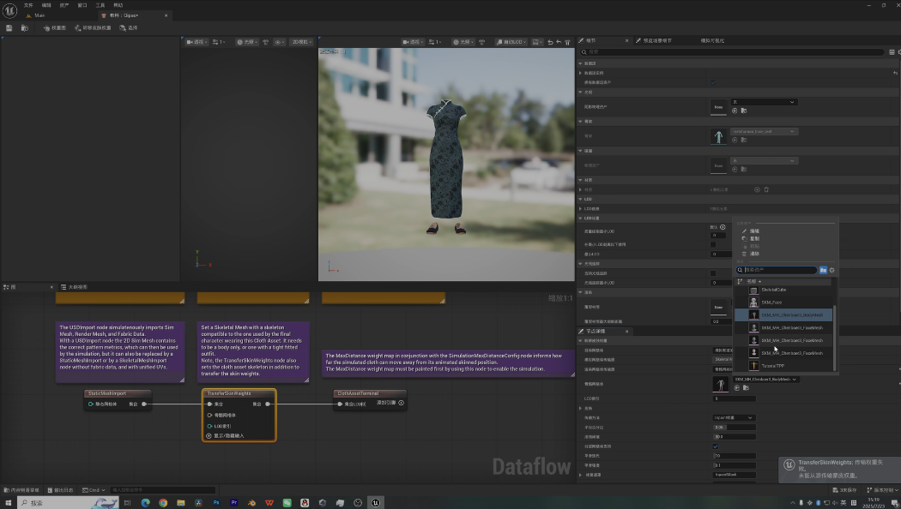

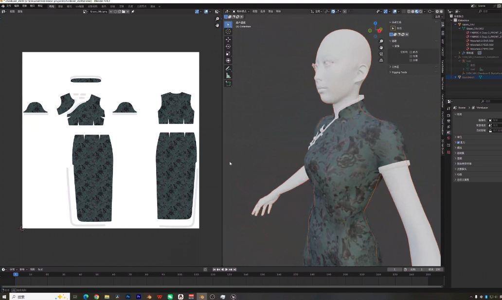

## 3. 动画制作与面部捕捉

### 身体动画

主要身体动作由 Cascadeur 制作，并结合 Mixamo 高质量动作库进行关键帧调整与融合，确保动作自然流畅。

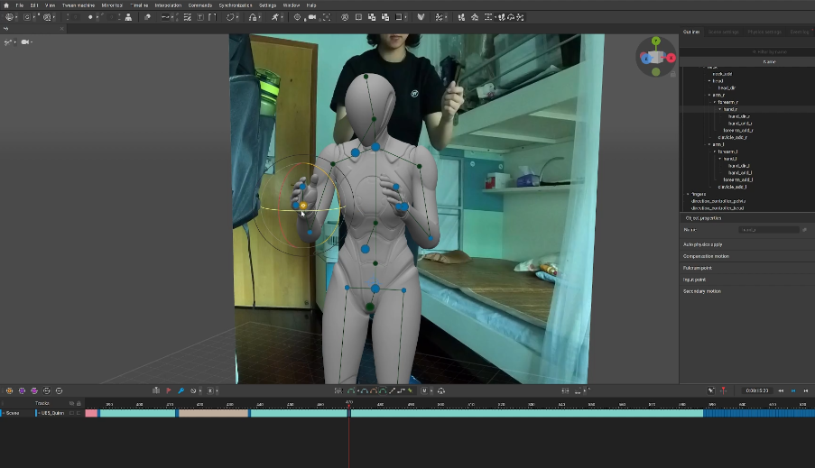

### 面部动画

项目使用 LiveLinkFace 进行面部捕捉。但在 UE 5.6 中，LiveLinkFace Importer 插件导入 CSV 并生成关卡序列后，烘焙脸部动画会失败。

经测试，UE 5.5 及以下版本可以正常烘焙。最终解决方案是：先在 UE 5.5 中完成任意面部动画烘焙，再将序列迁移至 UE 5.6，即可正常播放。同时，也可以使用关卡序列自带的录制器进行实时录制。

## 4. 点云动画特效

项目初期尝试使用 Blender 中的高斯泼溅插件进行点云动画设计，但存在明显局限：无法正确显示原始色彩信息，也缺乏对点云密度、透明度和生长节奏的精细控制，动画表现力不足，难以满足叙事需求。

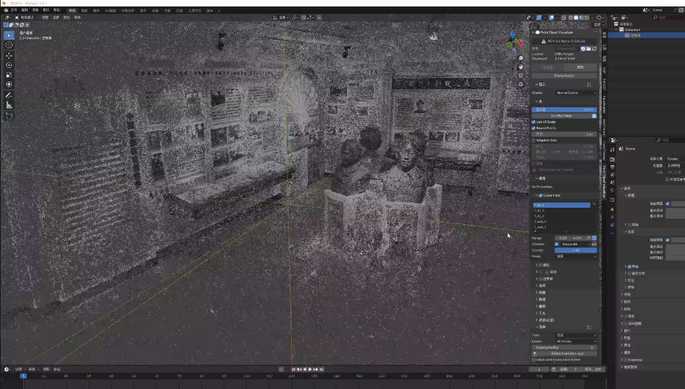

最终选用 After Effects 插件 Gaussian Splatting by Irrealix。该插件支持 PLY 文件直接导入，具备关键帧驱动的显式动画控制，可精确调节点云的显现顺序、渐变效果与空间运动轨迹，高效实现视觉意象，成为后期流程中的关键工具。

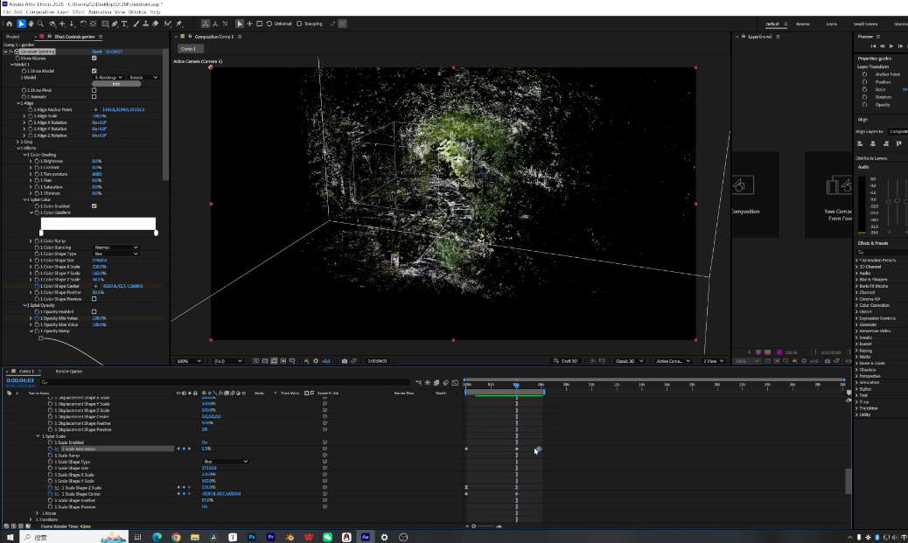

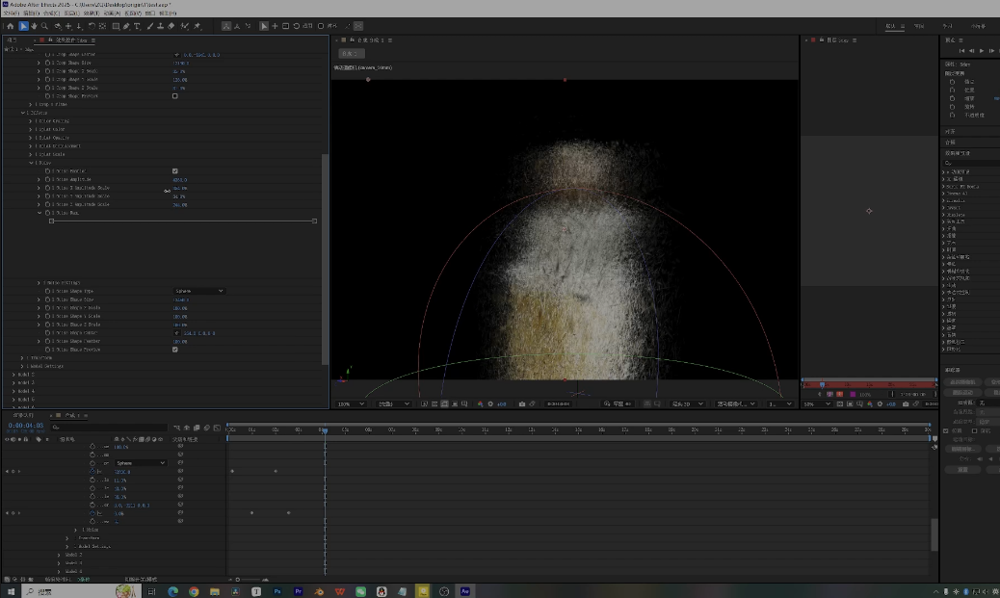

## 5. 工作流总结

这套工作流是在多次技术试错后形成的稳定路径，尤其在角色建模与点云可视化环节，体现了“技术理想”与“现实约束”之间的权衡。

最终，项目通过人工精修与工具组合完成了艺术表达目标，也为历史人物数字化与创新影像创作提供了一套可复用的实践范式。
