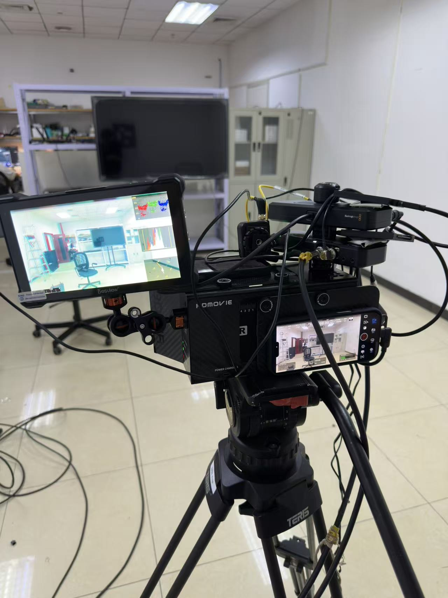
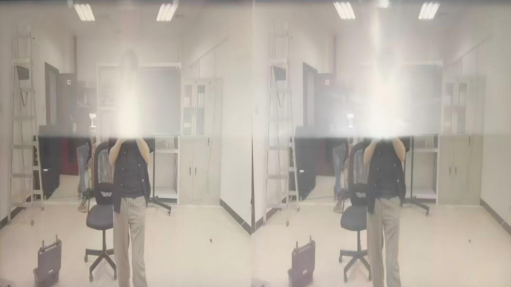

这份记录整理了一套双 iPhone 立体 3D 拍摄系统的硬件连接、同步校准和现场检查流程。它的重点不是单个设备，而是把分光系统、手机摄影机、外置接口、Genlock、Timecode、SSD 录制和实时 3D 监看串成一条可靠链路。

## 系统连接与硬件配置

### 核心光轴与音视频采集系统

- **分光与准直核心：** 系统核心架设在 PDMOVIE 3D AIR SMART 3D 影像系统上。两台作为主力摄影机的 iPhone 17 Pro 分别安置于上方（左眼）和后方（右眼），利用 3D AIR 的电控手动调校 IA 间距。
- **影视级接口扩展：** 两台 iPhone 17 Pro 分别接入各自独立的 **Blackmagic Camera ProDock** 扩展坞中。该扩展坞负责将 iPhone 的原生 USB-C 转化为标准影视工业接口，包括 HDMI、BNC Genlock、独立供电及外置存储接口，并适配 **Blackmagic Camera App**。

### 硬件级高精度锁相与时间码

- **同步源：** 采用 **Ambient Genlock** 作为同步锁相发生器。
- **链路设计：** 从 Ambient 发出高精度 Genlock 同步信号，通过 BNC 屏蔽线一分二接入两台 Blackmagic Camera ProDock 的 Genlock In 接口。
- **时间码：** 时间码使用谛听设备，连接 Blackmagic Camera ProDock 的 TC In 接口。
- **技术目的：** 配合 iOS 和 iPhone 17 Pro 的底层硬件级同步支持，让两台 iPhone 的传感器实现帧级同步，尽量避免 3D 拍摄中因双目快门不同步导致的运动撕裂与视觉眩晕。

### 数据存储与实时监看

- **高速录制：** 两台 ProDock 的独立扩展 USB-C 接口各外接一块高速移动固态硬盘，用于高码率 ProRes RAW 或 ProRes 422 HQ 视频的实时本地写入。
- **双耳监听：** 本次暂不接入双耳监听。
- **实时 3D 合成监看：** 两台 ProDock 的 HDMI Out 导出左、右目的原生画面，输入至 PDMOVIE 3D AIR 的内置合成板。经 3D AIR 硬件实时渲染处理后，支持红蓝、左右等立体模式，再通过 HDMI Out 传输至机载小监视器，供摄影师确认立体视差与对焦状态。

### 供电

- **主供电源：** 采用充电宝以及户外移动电源，例如 DJI Power 1000。
- **PDMOVIE 3D AIR 供电：** 使用 USB-C 供电，并保留内置电池作为机动供电。
- **Blackmagic ProDock 供电：** Blackmagic ProDock 标准直流输入为 **12V DC**。现场可通过升压线将充电宝输出稳定在 12V，分别接入两台 ProDock 的 DC 输入端。

## 现场拍摄前置校准

1. **开机顺序：** 开启 Ambient Genlock -> 开启 Timecode -> 连接手机 Blackmagic Camera App -> 开启小监视器 -> 最后开启 PDMOVIE 3D AIR。
2. **App 状态检查：** 务必确认两台 iPhone 的 Blackmagic Camera App 屏幕时码一致，上方均显示 **EXT** 与 **REF** 图标，表示硬件同步成功。

3. **App 核心设置对照表：**

| App 选项卡名称 | 核心设置项目 / 参数规范 |
| :--- | :--- |
| **录制编解码** | **焦段与裁切限制：** ProRes RAW 只能使用 24、13、100 三个后置原生焦段，其他格式可使用裁切。 **Genlock 触发限制：** 分辨率选择 4K 或以下可以 Genlock，Open Gate 不能，120fps 时也不能 Genlock。 **时间码显示：** 选择 ProDock。 |
| **摄影机** | 开启“锁定当前方向”。Reference Source 选择 External。 |
| **监看** | HDMI 输出选择视频信号。将监看限制在 HD，PDMOVIE 更不容易出故障。 |
| **媒体** | 将片段保存到文件，并选择 SSD。 |
| **配件** | ProDock 选择时间码。 |
| **远程摄像机控制** | 开启远程控制。建议机器上方的 iPhone（左眼）设置为被控设备，名称为 L；右眼为控制设备，名称为 R。打开多机位同步录制。 |

## 实操注意事项

- 回到首页摄影机，调整拍摄参数之前，点击左侧三个小圆点，最下方选择可用的摄影机。选择后点同步，所有按钮都开启，再调整拍摄设置。调完之后再点一次同步或者重新检查。**焦点和部分设置不能同步，必须手动设置。**
- **切勿点到屏幕画面。** 点按画面会把手动设置的焦点和曝光重新变成自动。
- 主控机画面左右滑动，一般向左滑动后，小监的红青显示就会出现。
- 拍摄时注意时间码上方是否同时出现 **REF** 和 **EXT** 两个标签。没有出现时，通常说明 Genlock 或 Timecode 没有连上。
- 拍摄非常容易过热，需要注意给 iPhone 降温，不要长时间手持。现场经验里湿纸巾降温效果最好，不拍摄时也应及时关闭屏幕。
