这篇文档整理自我在 ISFVF 字幕组工作期间留下的两份内部教程。原文档中包含服务器、账号、密码、内部表格和协作记录等信息，这里已经全部删去，只保留适合公开归档的字幕制作方法、字幕样式设置和质量检查要点。

## 1. 工作目标

字幕组的核心工作不是简单把 `.srt` 文件导入时间线，而是把影片、双语字幕、画幅、帧率和导出文件统一到可检查、可交接、可回溯的工程结构中。

公开版流程可以概括为：

1. 新建 DaVinci Resolve 项目。
2. 根据片源画幅和帧率设置项目。
3. 导入片源和中英文 `.srt` 文件。
4. 新建时间线并放入片源。
5. 插入双语字幕，调整字幕区域和样式。
6. 精校时间轴、断句、字数和画面贴合。
7. 分别导出中英文字幕，并保存工程备份。

## 2. 项目与时间线设置

新建项目后，先确认项目设置。关键参数包括时间线分辨率、时间线帧率、播放帧率、时间线色彩空间和输出色彩空间。

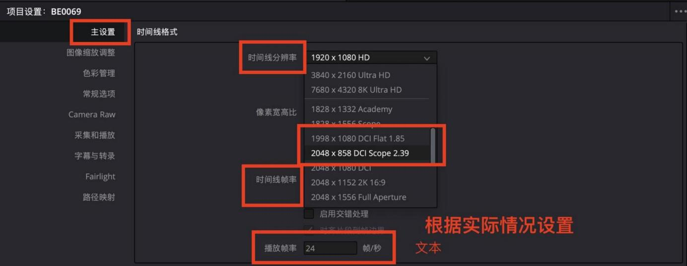

时间线色彩空间和输出色彩空间统一设置为 `Rec.709 2.4`。

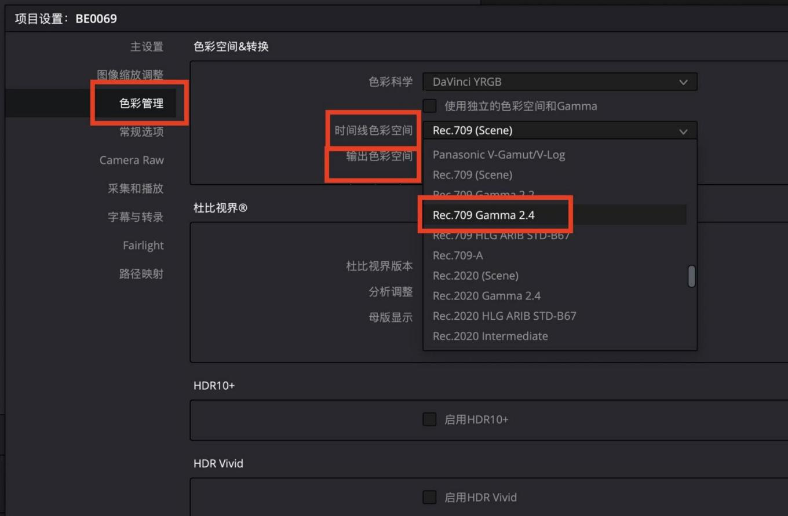

设置时要以片源实际信息为准。分辨率对应画幅，帧率对应片源文件本身，不要只依赖表格中的文字记录。

## 3. 时间线命名与片源检查

新建时间线时，将起始时间码设为 `00:00:00:00`。

时间线命名建议使用：

```text
编号_DCP_分辨率_Scope或Flat_帧率_版本号
```

例如：

```text
CNxxxx_DCP_2K_Scope_24_V1
```

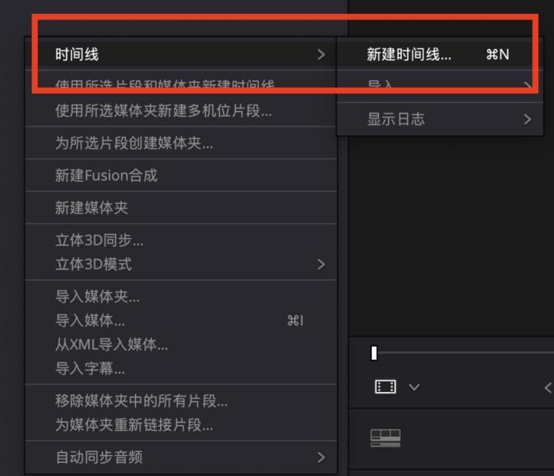

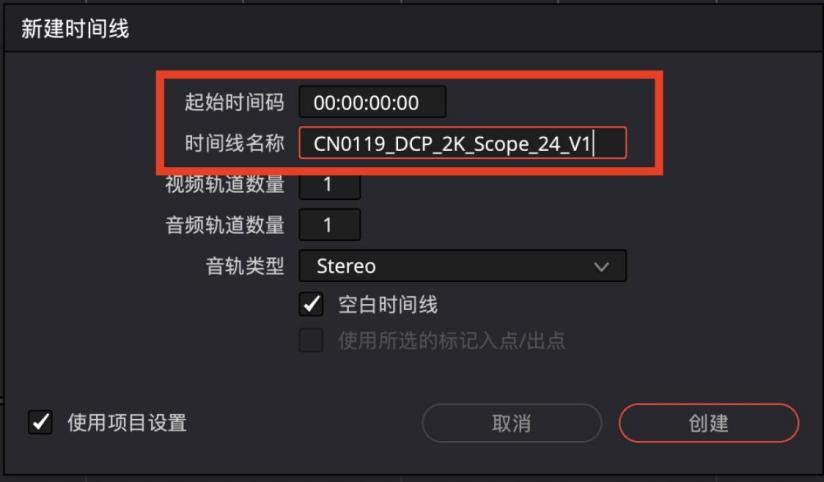

将原片素材拖入时间线后，需要检查画面大小是否贴合时间线画幅。如果出现裁切、画面过小或黑边异常，可以在“变换”中调整缩放，让画面刚好贴合目标画幅。

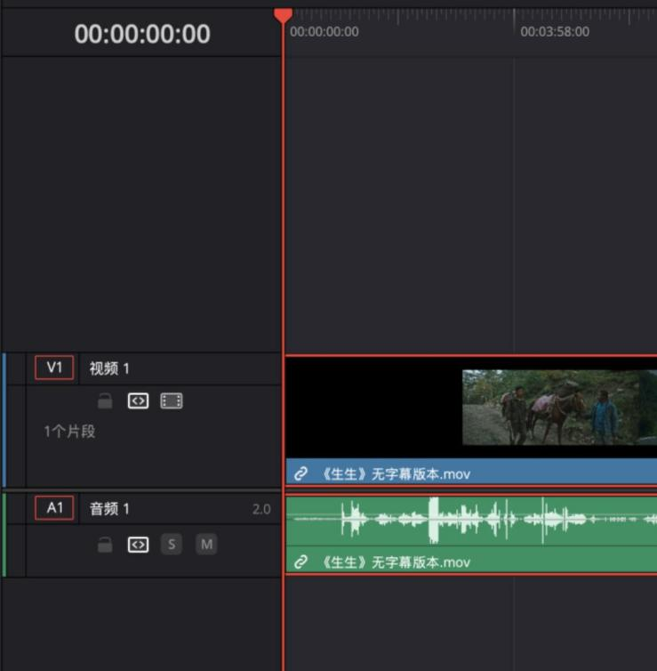

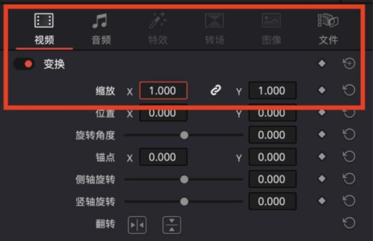

## 4. 双语字幕导入与字幕区域

插入字幕时，使用时间码将第一份字幕导入时间线。此时字幕通常位于字幕轨道 1。

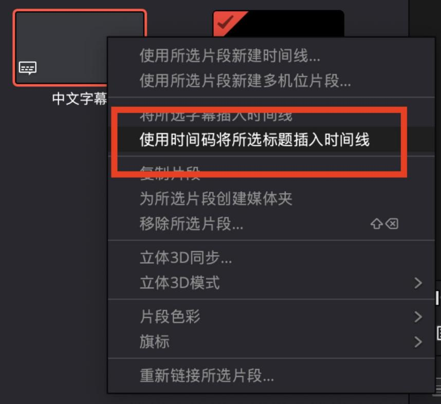

然后添加第二条字幕轨道，关闭轨道 1，打开轨道 2，再使用时间码插入第二份字幕。

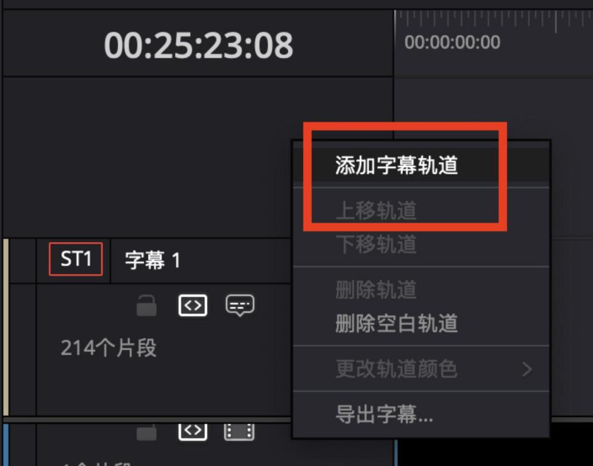

双语字幕需要使用字幕区域分开上下位置。通常做法是：在字幕轨道 1 添加新的字幕区域，再把轨道 2 中的字幕整体移动到下方字幕区域内。移动时可以开启磁吸，保持两条字幕开头对齐。

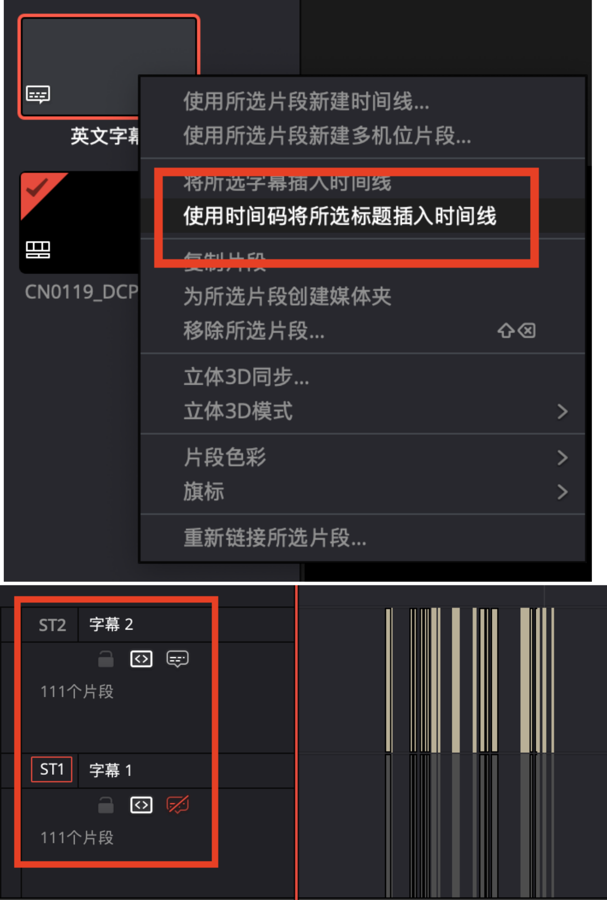

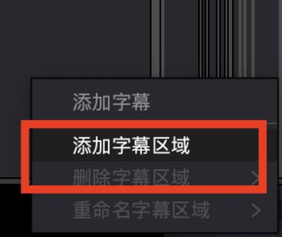

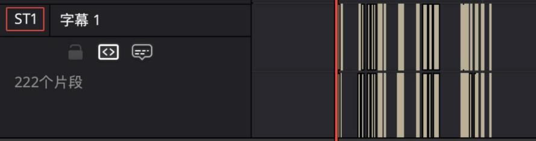

## 5. 字幕样式设置

字幕样式需要根据 DCP 画幅选择。公开版只保留样式设置截图，不包含任何内部账号或项目访问信息。

### Scope 画幅

Scope 画幅常用于宽银幕影片。设置字幕样式时，要保证双语字幕在下方安全区域内清晰可读，同时不要压到画面主体。

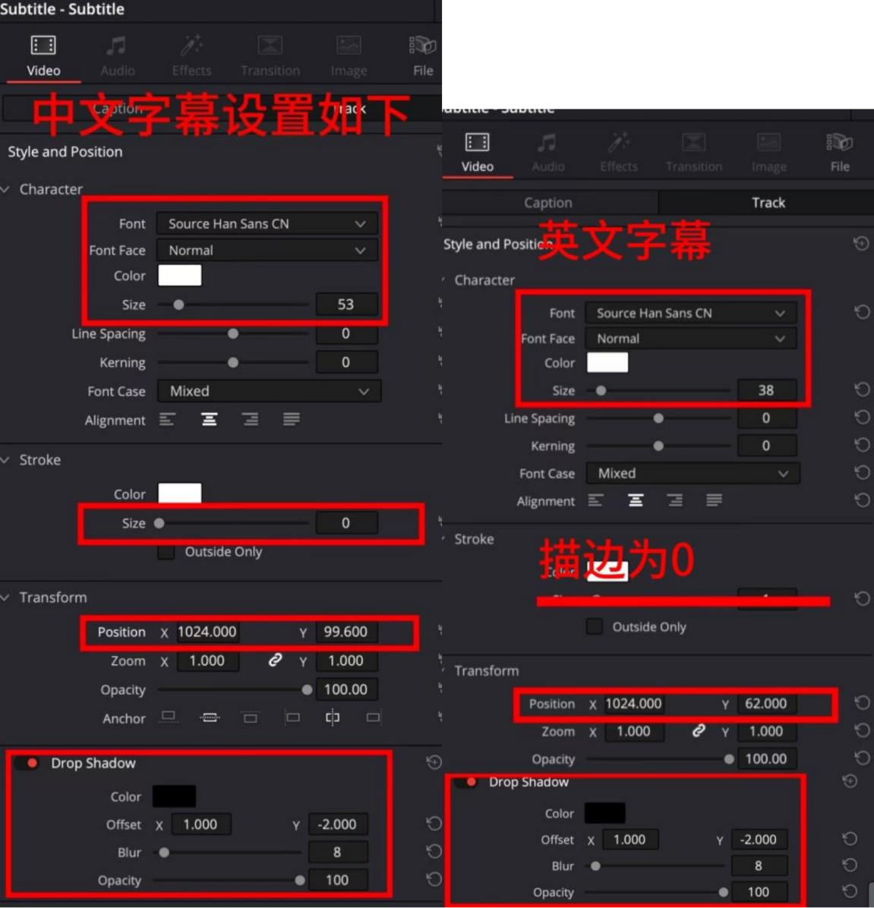

### Flat 画幅

Flat 画幅的垂直空间相对不同，字幕位置和间距需要按 Flat 规格单独设置。

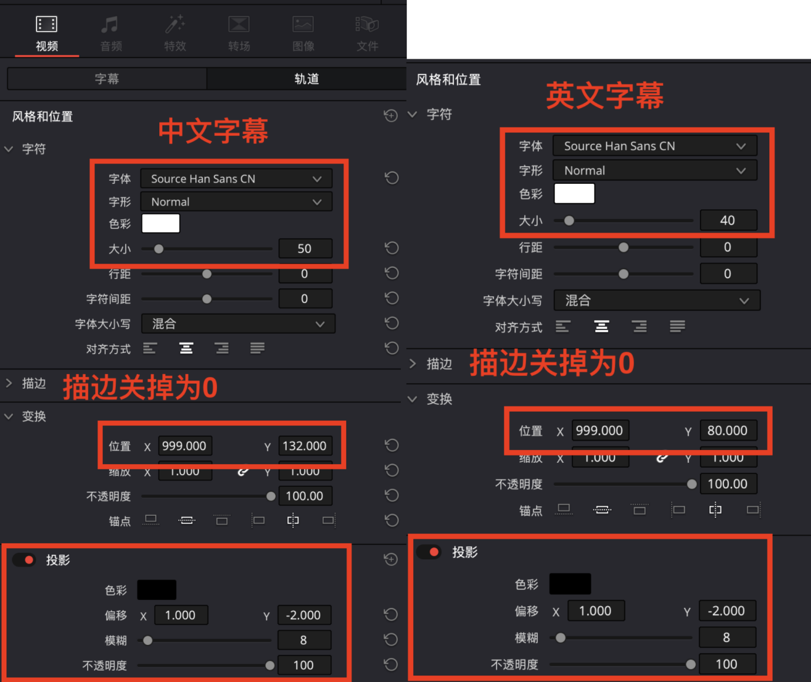

## 6. 精校原则

精校时重点检查四件事：

- 字幕出现时间是否贴近角色开始说话的时刻。
- 字幕消失时间是否自然，避免过早消失或拖到下一个镜头。
- 中文单行字数是否过多，通常一行不超过 15 到 16 个字。
- 英文是否根据语义自然断句，优先保证中英文整体节奏协调。

如果镜头已经切换，字幕应迅速截断，不要多停留一两帧到下一个画面，除非声音仍然持续。

如果遇到整段中英文时间轴明显对不齐的情况，优先把原文或主语言字幕的时间轴打准确，再处理另一条字幕轨道的整体偏移。不要为了强行对齐双语而牺牲人物说话的真实入点和出点。

字幕的入点通常跟随角色开始说话的瞬间；出点可以在话音结束后略微停留，让观众有阅读缓冲。停留时间不是机械固定的，要结合语速、镜头剪切和字幕长度判断。演员语速极快时，应优先精简字幕，让观众在短时间内抓住主要信息。一条字幕的持续时间不宜过短，原则上至少接近 1 秒；如果画面节奏特别快，可以灵活调整，但要避免一闪而过。

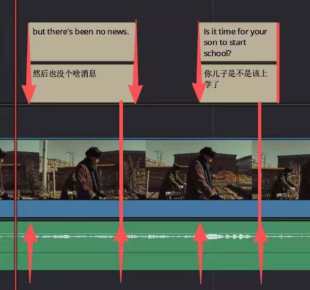

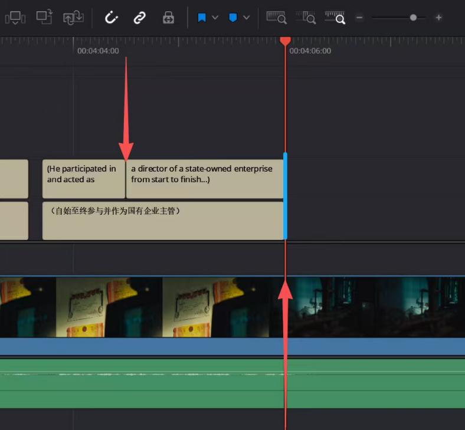

### 断句与换行

断句首先服从语义，其次服从节奏。双语字幕中如果某一种语言过长，可以按语义单独断句，不必机械要求中英文每一处换行完全一致。理想情况是中英文一起断，但当中文很短、英文很长时，可以只断英文。

一句话说完后再断，比提前断更自然。两句话之间如果间隔很短，且字数不多，可以放在同一字幕单元里；如果间隔稍长，即使字数少，也应该换到下一行或下一条字幕。这样观众能通过字幕节奏感受到台词停顿。

## 7. 字幕文本规范

字幕文本需要服务于观看体验，原则是清楚、短促、符合语气。

- 严格来说，中文每行不超过 15 个字；实际制作中可根据语气和画面节奏微调。
- 同一个人连续说的两句话，如果间隔很短且总字数不多，可以放在同一行。
- 如果两句话间隔稍长，即使字数少，也应换到下一行。
- 一般不加标点，用半角空格承担停顿功能。
- 数字通常写成汉字；年代、房间号、地址编号等可保留阿拉伯数字。
- 外语口语应翻译为中文含义，不要保留无必要的外语原词。
- 重复语句按实际听感保留，但超过三次时通常只保留三次。
- 片名、戏剧名、书名等使用书名号。
- 明显影响观看的脏话或口头填充词，可以按语境删减。

空格是中文字幕里最常用的轻停顿工具。比如“来进来”应处理为“来 进来”，“小王快点”可处理为“小王 快点”。空格使用半角空格，不要用全角空格。

数字的处理要看语境。一般数量、次数写汉字，例如“三遍”“十三次”；年代、日期、房间号、地址编号保留阿拉伯数字，例如“2012 年 12 月 30 日”“西土城路 4 号”。外语寒暄或口头词如果没有保留原文的必要，应翻译为中文意思，例如 `hello` 处理为“你好”。

有些儿化音会影响自然口吻，需要保留，例如“去哪儿”“一会儿”“什么事儿”“哥们儿”“逗你玩儿”“歇会儿”。如果删掉儿化音会让台词显得生硬，就应保留。

常见易错词包括：

```text
说得好 / 干吗呢 / 工夫 / 侦察 / 贸然 / 净瞎说 / 怄气 / 说话的权利 / 算账
```

“的、地、得”如果拿不准，应重新判断它在句子中的语法位置：

- `的`：多用于定语或谓语后。
- `地`：前面通常是形容词或副词。
- `得`：多位于动词和补语之间，或接程度补语。

## 8. 画幅与帧率判断

当资料表中没有片源分辨率和帧率时，可以先新建项目，但暂不完成项目设置和时间线创建。将片源放入 DaVinci Resolve 的媒体池后，可以直接查看分辨率和帧率。

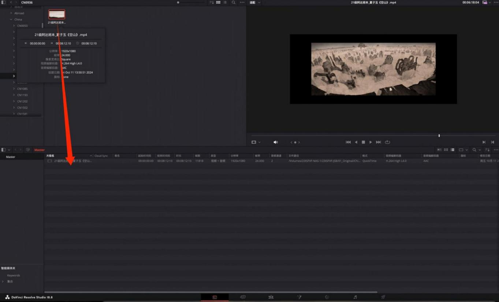

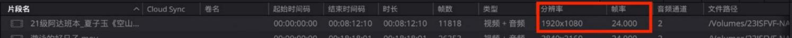

如果媒体池不是列表视图，可以切换为列表模式，方便查看分辨率和帧率字段。

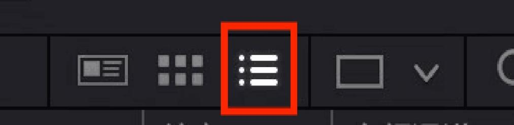

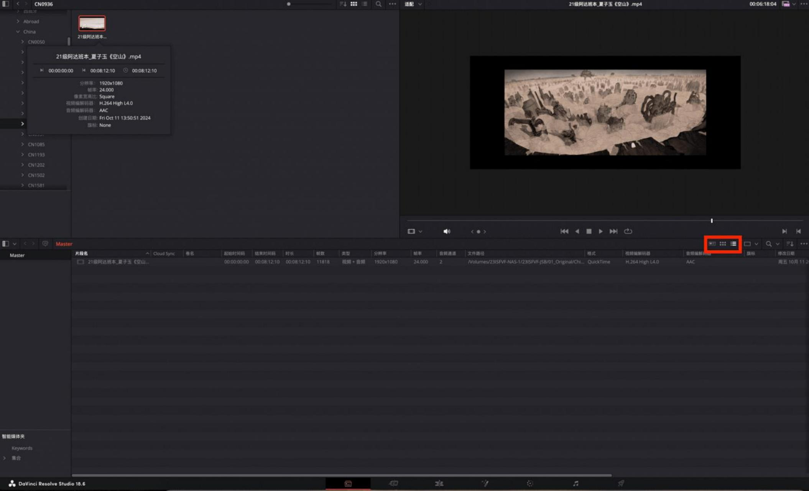

画幅比可以用宽度除以高度判断：

```text
3840 / 2160 = 1.78  -> Flat
2048 / 858  = 2.39  -> Scope
```

类似地，当宽高比小于 `2.1` 时，通常按 Flat 制作；当宽高比大于 `2.1` 时，通常按 Scope 制作。宽高比是选择时间线分辨率的核心依据。

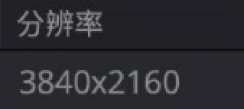

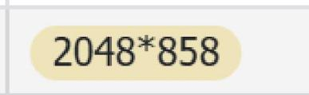

时间线分辨率只能在 2K 规格中选择，因此时间线命名中的“分辨率”统一写 `2K` 即可。

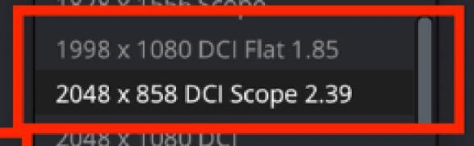

## 9. 特殊画幅情况

有些片源文件分辨率与实际画面分辨率不一致。例如片源显示为 `1920x1080`，但画面里有明显上下遮幅。此时不能只按文件分辨率判断，而要观察真实有效画面。

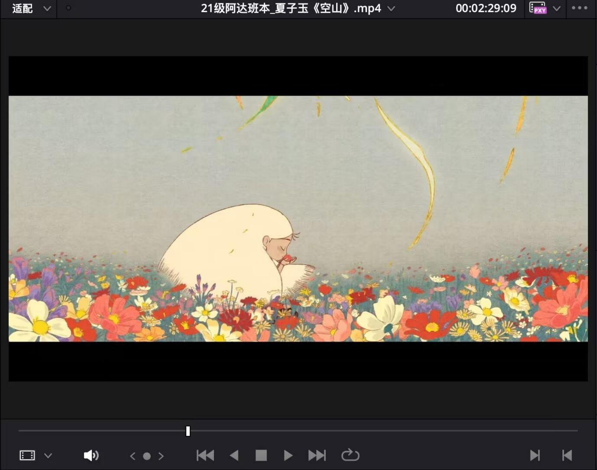

这种情况下，可以尝试将项目设置中的时间线分辨率改为 `2048x858 DCI Scope 2.39`，再通过“变换”缩放检查黑边是否明显减少。

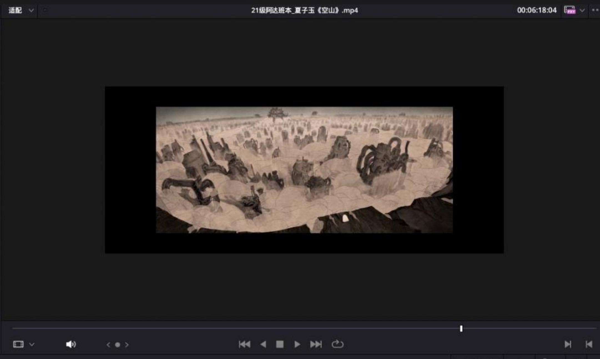

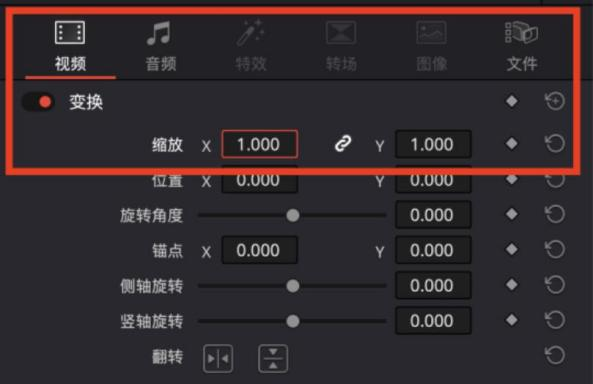

如果调整后画面贴合 Scope 逻辑，就应按 Scope 制作，并同步修改时间线命名。

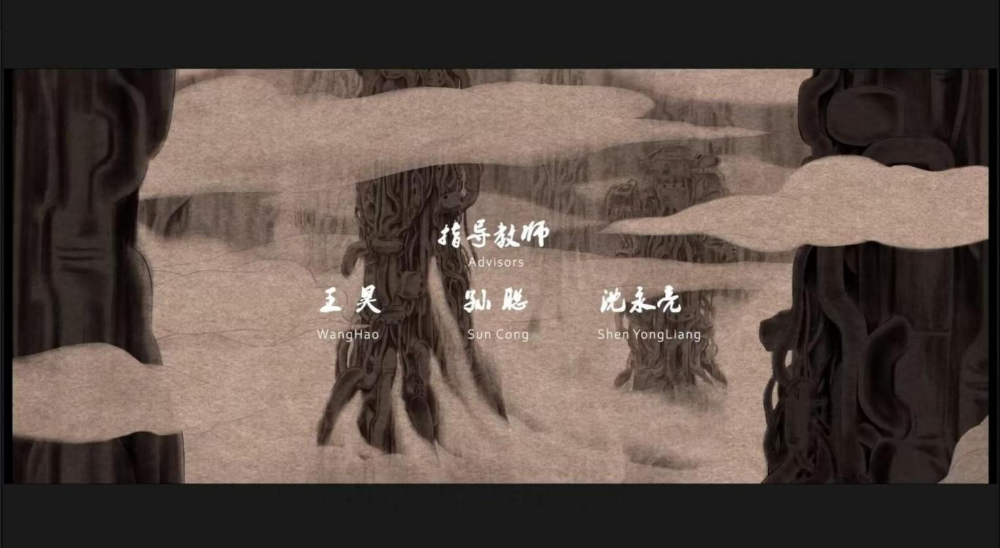

## 10. 导出与交接

导出前先保存工程。导出字幕时，需要分别导出中英文字幕文件。

推荐命名方式：

```text
中文字幕：编号_日期_CN_版本号
英文字幕：编号_日期_EN_版本号
```

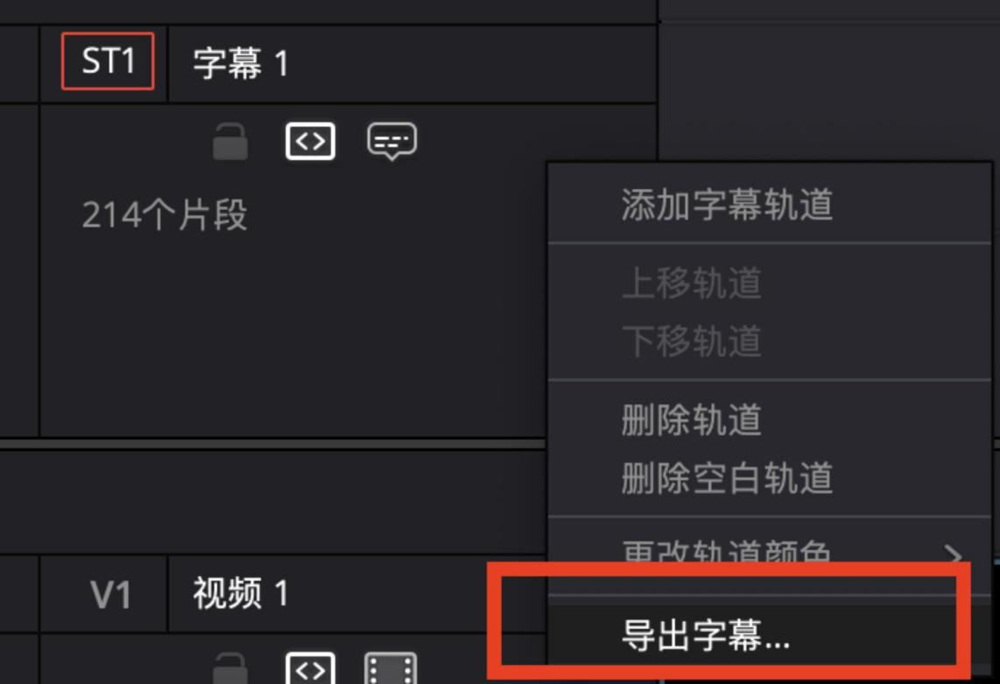

工程导出命名建议保留编号、片名或拼音缩写、当前日期与版本号，便于后续检查和回溯。

## 11. 公开版保留与删减说明

为了适合放入公开 Archive，本文删去了以下内容：

- 电脑、服务器、NAS、项目库等账号和密码。
- 内部协作表格、工作日志、群聊通知格式和负责人信息。
- 带有内部路径、内部表格或敏感访问入口的截图。

保留的部分集中在字幕制作本身：DaVinci Resolve 的项目设置、字幕区域、双语字幕排布、Scope/Flat 样式设置、打轴与断句规范、画幅判断和导出命名。
