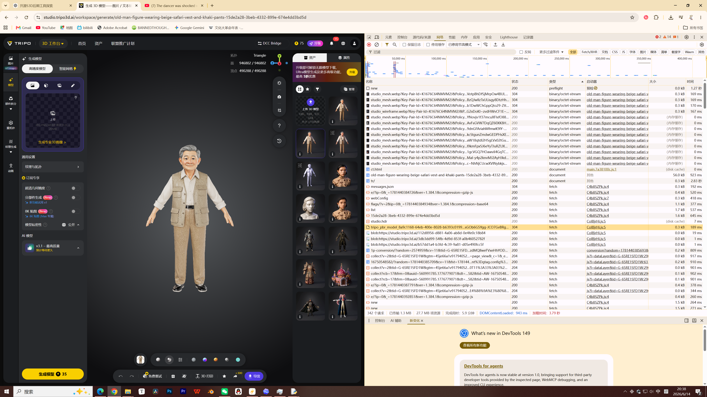
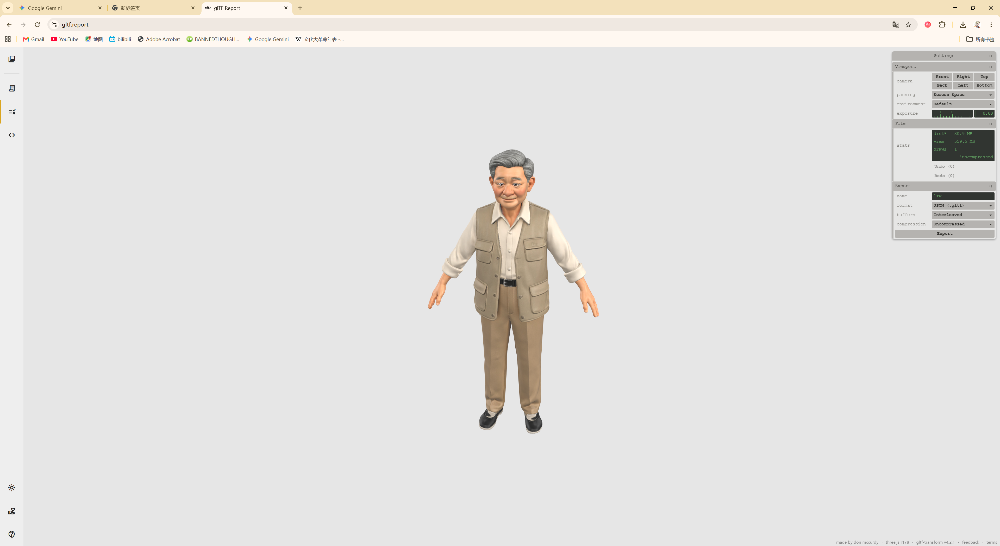

---
title: "Tripo 模型文件下载与 GLTF 转换记录"
description: "记录从浏览器网络面板定位 Tripo 模型文件，并通过 gltf.report 转换后导入 Blender 的简短流程。"
pubDate: 2026-06-14
tags: ["Tripo", "3D Workflow", "Blender", "Tutorial"]
---

按 F12 进入开发者模式，点击 Network 标签。

按类型排序，找到 tripo 开头的文件，右键在新标签页打开，浏览器会自动下载。

打开 https://gltf.report/ ，导入下载文件，按需要调整设置。导出后即可在 Blender 中打开。
