---
title: "数字摄影技术笔记"
description: "摄影史、成像原理、透视、景深、色彩与数字影像基础的课程笔记整理。"
pubDate: 2025-05-16
tags: ["Photography", "Digital Imaging", "Notes"]
---

## 1.摄影史
#### 画意与沙龙摄影
* 摄影与绘画
  - 工业文明产物，现代性，具有复制属性
  - 摄影具有客体性；绘画具有主体性
  - 现在为绘画与摄影的互相学习
#### 先锋主义摄影
- 利用摄影表达对现代主义的诉求
- 拉兹洛丶莫霍利丶纳吉
- 曼雷
- 意义：迈向直接摄影的第一步，寻找摄影的本体语言
- 局限：未达到本体，更多使用拼接和蒙太奇的手段
#### 摄影的自觉：分离派
* 摄影分离派（也称摄影决裂者），由阿尔弗里德丶斯蒂格利兹（美国现代摄影之父）创立
* 不借助其他手段，仅用摄影技术准确真实表达被摄对象的理论和现实，摆脱绘画主义，成为独立的一门艺术。
* 摄影中心从欧洲转移到美国
* 求美→求真
#### 直接摄影（如实摄影）
* 形式在传达情感和心里状态起着关键作用
* 爱德华丶斯泰肯
* 保罗丶斯特兰德
#### F64
* 用最小光圈获得影像的最大景深，力求作品有最清晰的画面。
* 安塞尔 亚当斯 安德华 维斯顿
#### 纪实（社会纪实摄影）
* 尤金丶阿杰特 法
  * 第一个使用documentary photography的人
  * 拍摄的巴黎不经修饰，具有纪录片的效果
* 沃克丶埃文斯
* 不仅强调如实记录，也强调社会属性的作用
* 一战后，成为讲述斗争的工具，揭露苦难，崇尚平等
* 二战后，转向自己和自己周边的事，表达对自己的质疑和批判
* 1976年的“新纪实”摄影展 萨考夫斯基
  - 在moma举办 
  - 社会即个人，个人即社会
  - 去主题化 赞美日常
* 私密摄影
  - 摄影转入更私密的空间，由外而内的脉络更加清晰
  - 揭穿了摄影的虚伪性
#### 当代
* 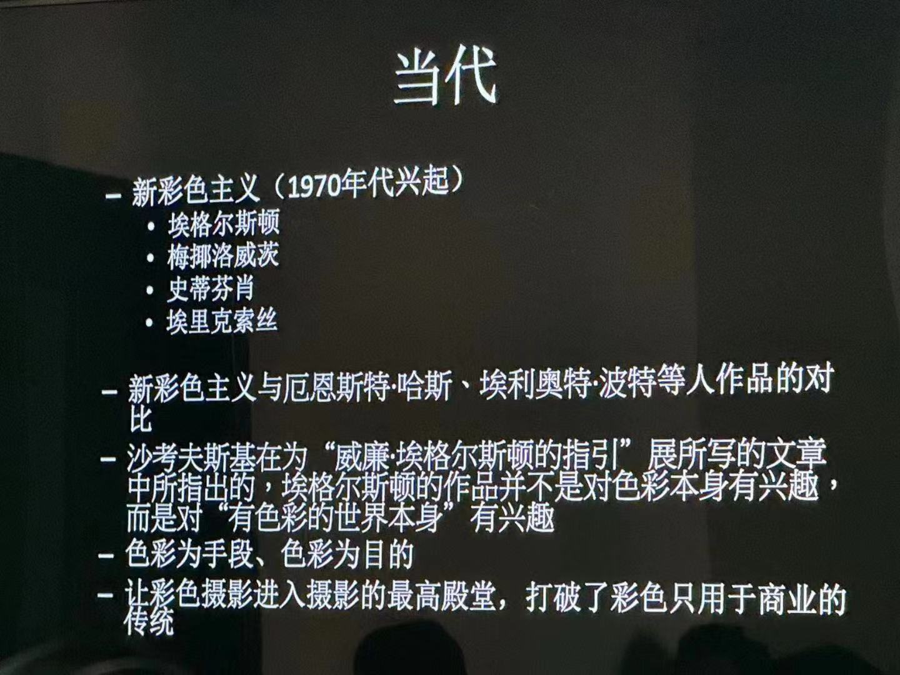
  
  
  
* 贝歇夫妇与杜塞尔多夫学派
  * 贝歇夫妇（伯恩丶贝歇与希拉丶贝歇）的摄影可以被认为是一种观念艺术，类型学研究，拓扑学的纪实文本，“工业考古学”
#### 中国当代摄影的形式与内容
* 绘画的重要人物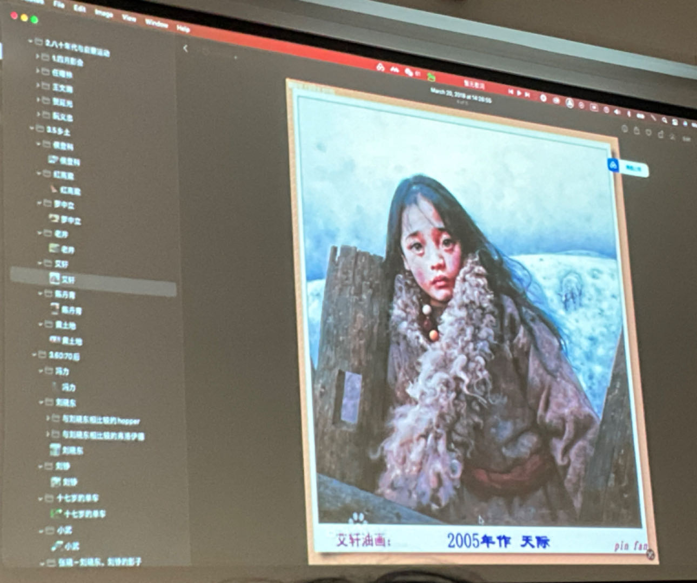
#### 总结
* 摄影的本质是一种转化，将客体性转换为一种主体性
* 这里的主体性与主观意图不同，主体性往往事被隐藏的和需要被反复解读的
* 摄影的真实性不是一般认为的真实记录，而是剥离客观对象和作者主观意图之后留下的可能被认识到的部分

## 2.小孔成像: 

#### 小孔与镜头的区别

[小孔成像原理](https://www.zhihu.com/search?q=小孔成像原理&search_source=Entity&hybrid_search_source=Entity&hybrid_search_extra={"sourceType"%3A"answer"%2C"sourceId"%3A266538016})的相机是针孔相机，也称照相暗箱，为[照相机](https://link.zhihu.com/?target=https%3A//baike.so.com/doc/5354948-5590412.html)的原型。是一种没有镜头、只有一个针孔大小的光圈的简单相机。在摄影历史中，第一部相机就是针孔相机。最简单的针孔相机可以是一只不透光的盒子，在某侧开一个针孔即可。光线通过针孔后会在盒子的另一面产生颠倒的投影。**[针孔相机](https://www.zhihu.com/search?q=针孔相机&search_source=Entity&hybrid_search_source=Entity&hybrid_search_extra={"sourceType"%3A"answer"%2C"sourceId"%3A266538016})不存在焦距的概念，所以没有对应的调节装置**。因为针孔相机需要较长的[曝光时间](https://link.zhihu.com/?target=https%3A//baike.so.com/doc/6930168.html)，所以快门可以手动操作。常见的曝光时间从 5 秒到数小时不等。

现在的数码相机是[透镜成像原理](https://www.zhihu.com/search?q=透镜成像原理&search_source=Entity&hybrid_search_source=Entity&hybrid_search_extra={"sourceType"%3A"answer"%2C"sourceId"%3A266538016})。利用凸透镜成倒立缩小的实像,而凸透镜成像的原理的本质就是光的折射。

## 3.透视：

#### 与照相机的机位和姿态有关，其它无关

在三维空间中，pan（横摇）、tilt（俯仰）和roll（滚转）分别表示三个轴上的旋转。

1. Pan（横摇）：绕垂直于地面的Y轴旋转。通常用于表示水平方向的旋转，如摄像机水平旋转以观察不同方向的场景。
2. Tilt（俯仰）：绕水平的X轴旋转。通常用于表示在垂直方向上的旋转，如摄像机向上或向下倾斜，以观察不同高度的物体。
3. Roll（滚转）：绕垂直于视线的Z轴旋转。表示物体或摄像机在其自身轴上的旋转，类似于飞机机翼翻滚。

在三维空间中，[pitch](https://so.csdn.net/so/search?q=pitch&spm=1001.2101.3001.7020)（俯仰）、yaw（偏航）和roll（滚转）分别表示三个轴上的旋转。

1. Pitch（俯仰）：绕水平的X轴旋转。通常用于表示在垂直方向上的旋转，如摄像机向上或向下倾斜，以观察不同高度的物体。
2. Yaw（偏航）：绕垂直于地面的Y轴旋转。通常用于表示水平方向的旋转，如摄像机水平旋转以观察不同方向的场景。
3. Roll（滚转）：绕垂直于视线的Z轴旋转。表示物体或摄像机在其自身轴上的旋转，类似于飞机机翼翻滚。

## 4.凸透镜成像规律：

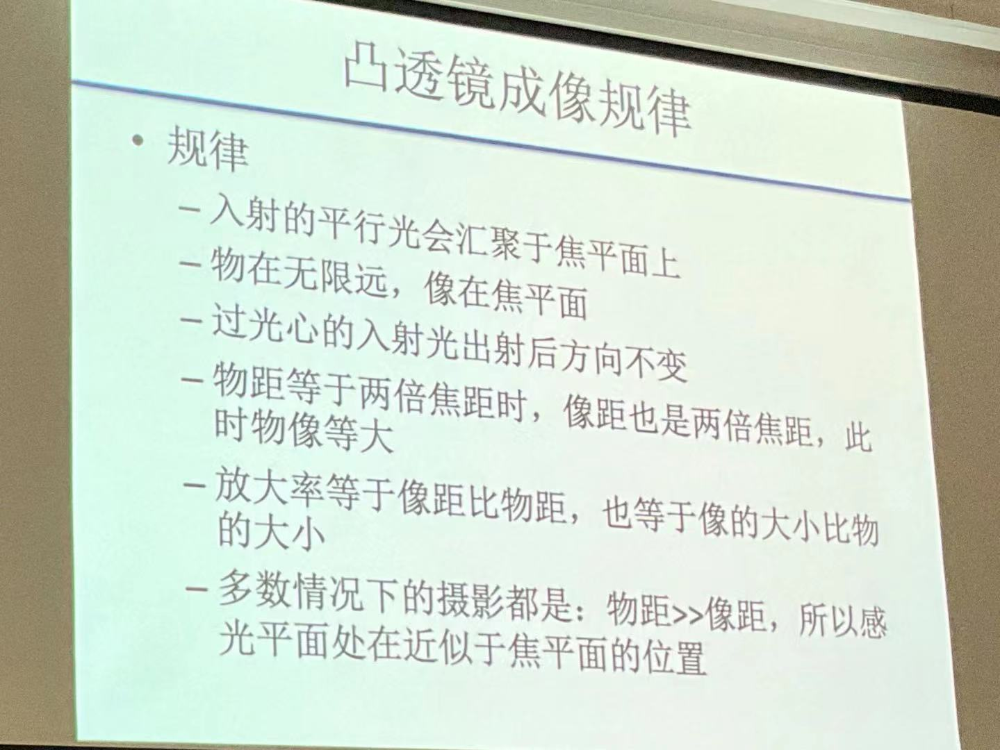

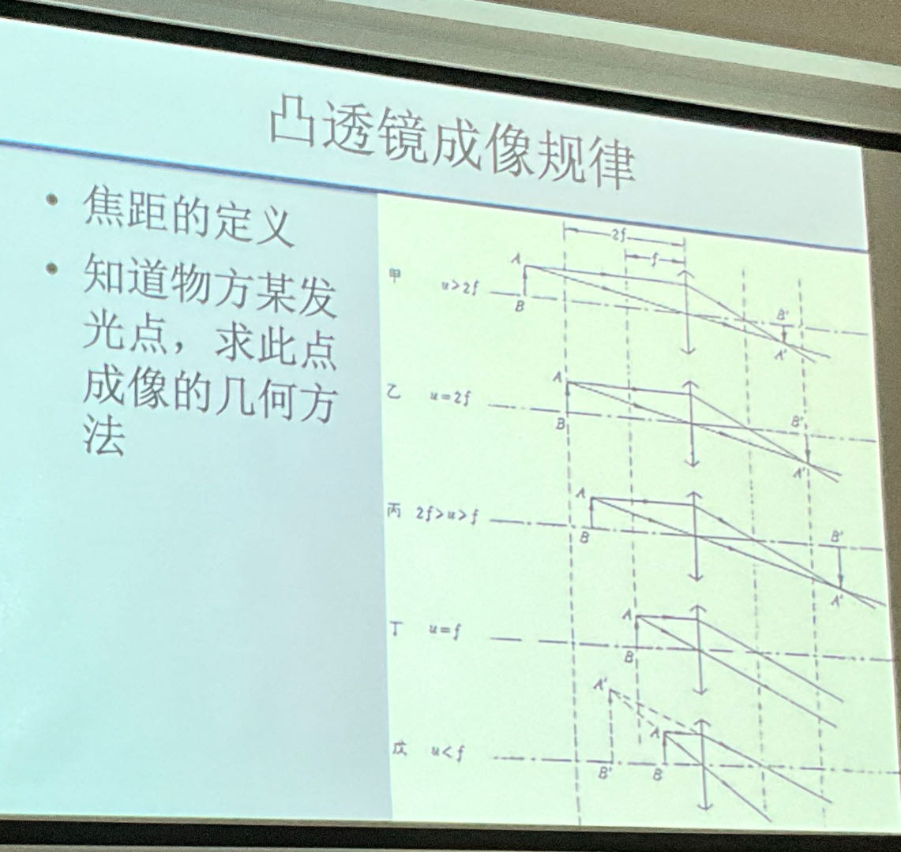

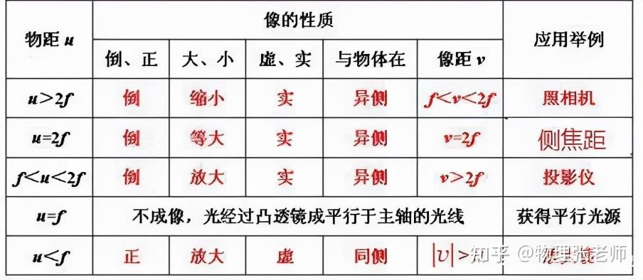

## 5.镜头的主点、节点和入瞳的概念

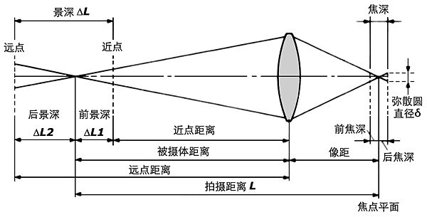

1. 光学系统

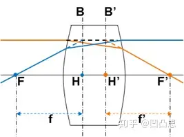

- 主平面：成像放大率等于1的一对共轭面，如图中B,B’
- 主点：主平面与光轴的交点，如图中H,H’
- 焦点：平行光轴入射光线与光轴的交点, 如图中F,F’
- 焦平面：焦点所在的垂直于光轴的平面
- 焦距：焦点与主点的距离, 如图中f,f’

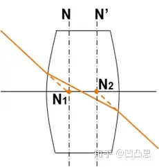

- 节点：入射光线与出射光线平行时，两光线延长线与光轴的交点。N1和N2分别为物方与像方节点。物空间介质与像空间介质相同时，节点与主点重合。

## 6.视差概念

## 7.镜头焦距、等效焦距、标准焦距的概念

镜头焦距（Focal Length）：这是镜头的一个基本特性，表示镜头光学中心到成像平面（通常是感光元件）的距离。镜头焦距的单位是毫米（mm）。焦距决定了镜头的视角范围，焦距越短，视角越宽，能捕捉到更广阔的场景；焦距越长，视角越窄，更适合远距离拍摄。例如，广角镜头焦距较短，而长焦镜头焦距较长。

等效焦距（Equivalent Focal Length）：这是一个将不同格式相机（如全画幅、APS-C等）上的镜头焦距换算到标准全画幅相机上的焦距的概念。由于不同格式的相机感光元件尺寸不同，相同焦距的镜头在不同格式相机上拍出的画面会有所不同。因此，等效焦距是为了在视角上进行标准化的一种换算。例如，一个50mm镜头在APS-C格式相机上可能会有一个等效焦距大约为75mm（这取决于具体相机的裁剪因子）。

标准焦距（Standard Focal Length）：这通常指的是在全画幅相机上约为50mm的焦距，因为这个焦距产生的视角接近人眼所见的视角。在APS-C相机上，大约30-35mm的焦距会提供类似的视角，因此可以视为该格式的“标准焦距”。

## 8.取景器的种类与特点

#### 同轴取景器与单镜头反光取景器

- 无视差取景
  -取景范围
  一 从取景器中所看到的范围与实拍范围相比的比例
  -100%、92%、90%

#### 旁轴取景器

- 结构简单、拍摄噪音低、机身小巧、便携性好
- 取景视差

#### 彩色液晶显示器

- 取景、播放影像、显示功能菜单
- 规格参数一一尺寸、分辨率、刷新频率、可调节性

## 9.单反与微单在机构上的差别，快门的差别

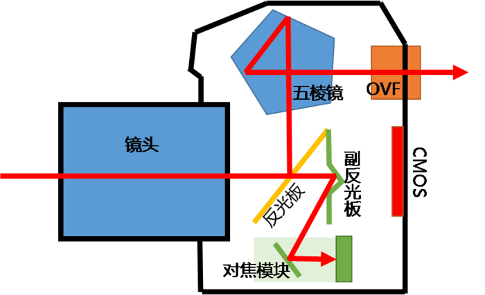

## 10.光圈的所有概念：

#### 光圈值公式

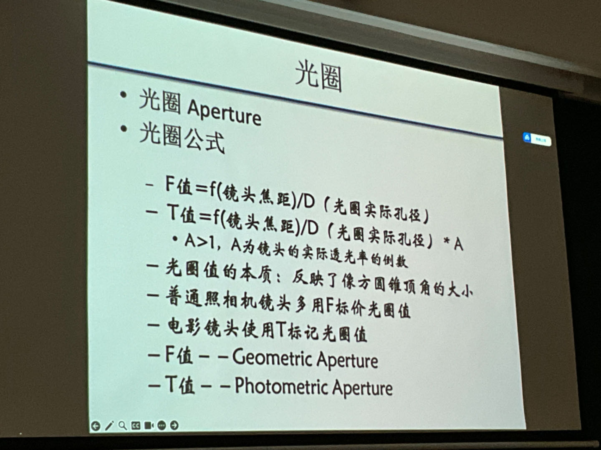

#### 光圈级，光圈大小与成像质量，T值F值等

对光圈值的解读
- 光国值越大，光孔越小
- 光国值越小，光孔越大
- F1.0代表光孔直径与镜头焦距相等
一 相同焦距的镜头，光国值越小，光国实际孔径越大，通光量越大相同光图值的镜头，焦距越长，光国实际孔径越大，所以长焦大光国债头口径大，价格高
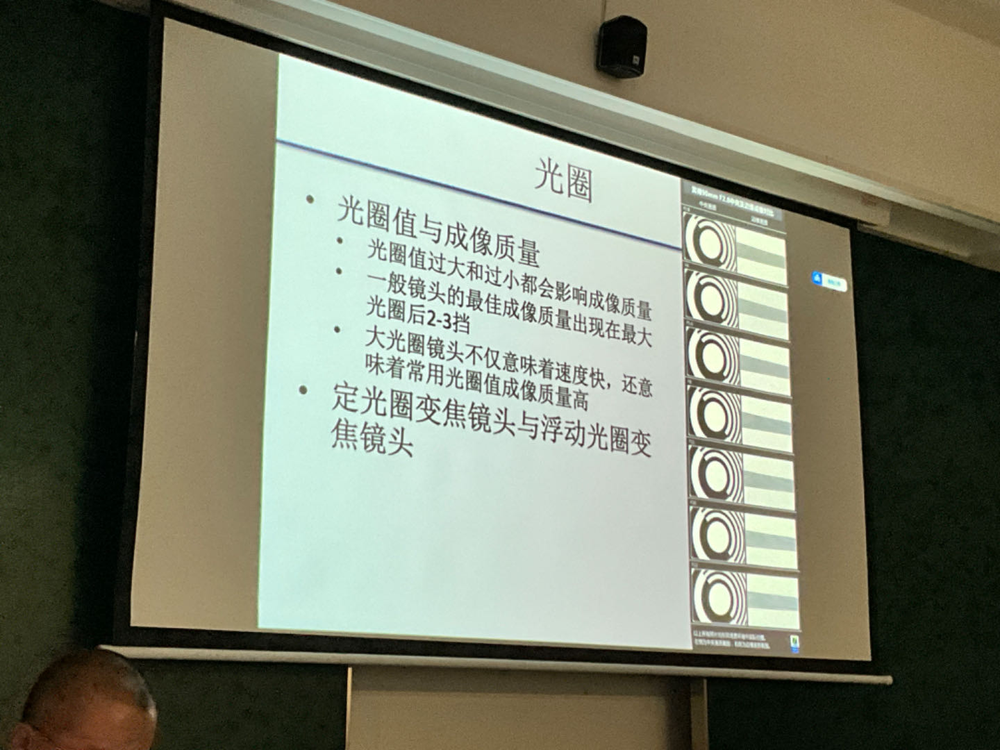
- 

## 11快门的所有概念：

#### 快门级数、帘幕快门，不同相机快门运动流程，滚动式快门，快门震动

牢记以下快门时间
- 1 1/2 1/4 1/8 1/15 1/30 1/60 1/125 1/2501/500 1/1000 1/2000
- 关键时间
·1/100-震动最小
·1/500-镜间快门最高速度
。1/125-帘幕最快运动速度
·1/16000-帝幕快门最快速度
- 一手持拍摄快门时间·快门时间小于焦距倒数

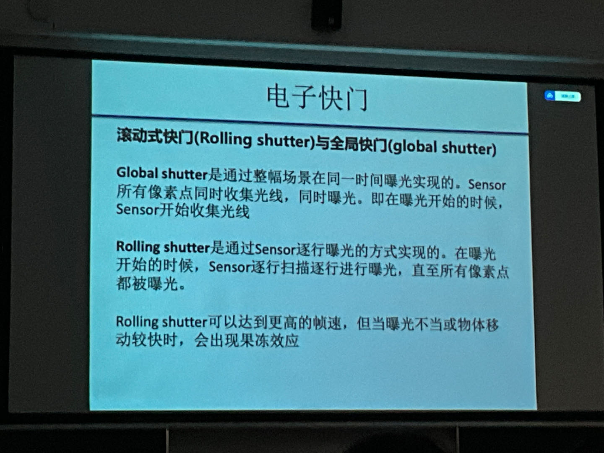

## 12.景深的概念：

与景深相关的因素，最小弥散圆，前后景深，超焦距，沙姆定律，移轴

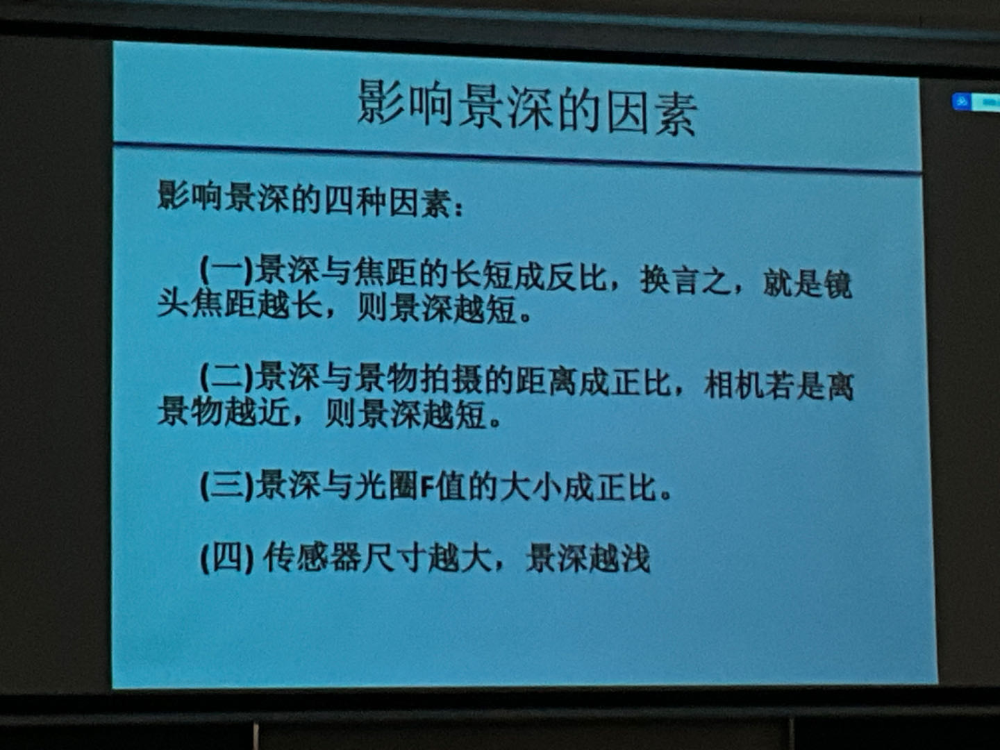

######  沙姆定律

* 对焦平面、镜头平面、成像平面，这三个平面都相交于一条直线
超焦距（Hyperfocal Distance）：超焦距是指当镜头对焦于此距离时，从该距离的一半到无穷远处的区域都会在接受范围内清晰，确定超焦距后，将镜头对焦到这个距离，可以确保从该点的一半距离到无限远处的物体都在清晰可见的范围内。
移轴镜头（Tilt-Shift Lens）：
移轴镜头允许摄影师改变镜头的角度（倾斜）和位置（移位）相对于相机的感光元件。这种类型的镜头主要用于建筑摄影和风光摄影。
倾斜（Tilt）功能可以改变焦平面，使得不同的部分进入或离开焦点，从而控制景深，甚至在广角镜头下产生大景深效果。
移位（Shift）功能则用于控制透视，特别是在建筑摄影中，可以防止建筑物看起来像是向后倾斜的效果。通过上下或左右移动镜头，可以改变拍摄角度而不必改变相机的位置，从而保持线条的直线性

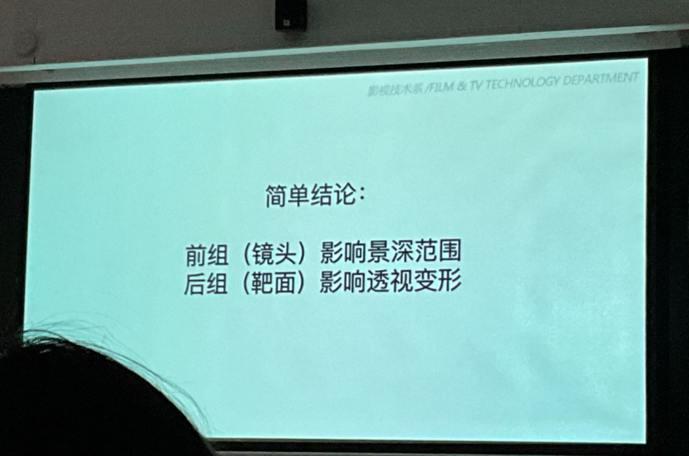

## 13.感光概念：

人眼的非线性特性，胶片感光特性曲线，感光度，感光度级数，感光度与噪波

## 14.传感器：

CCD与Cmos同异点，分光方式（bayer模式，棱镜式分光）

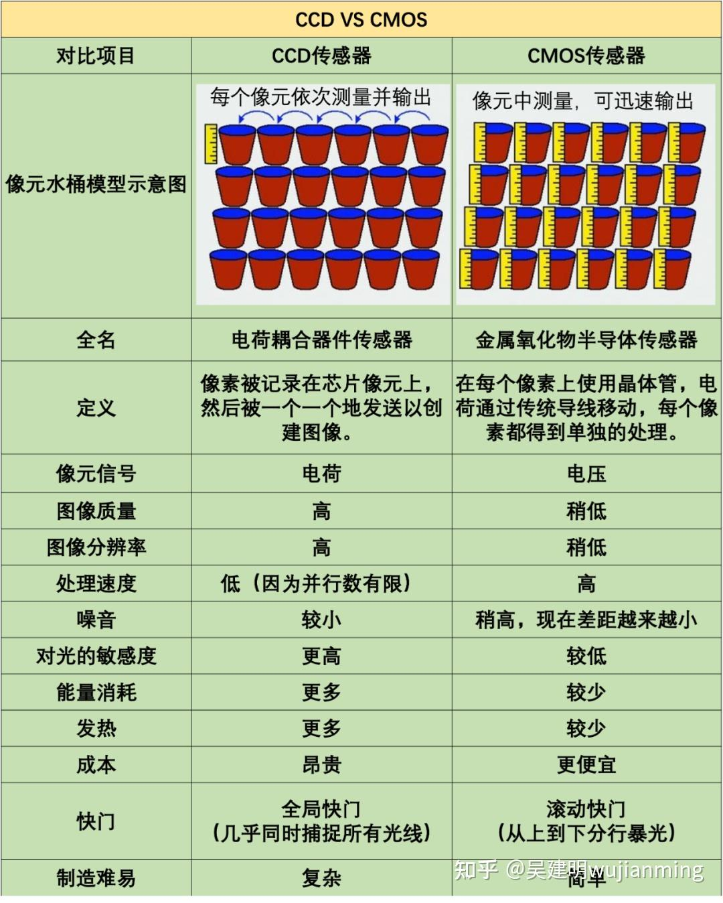

## 15.动态范围：

动态范围的概念，人眼的动态范围，动态范围与感光度的关系

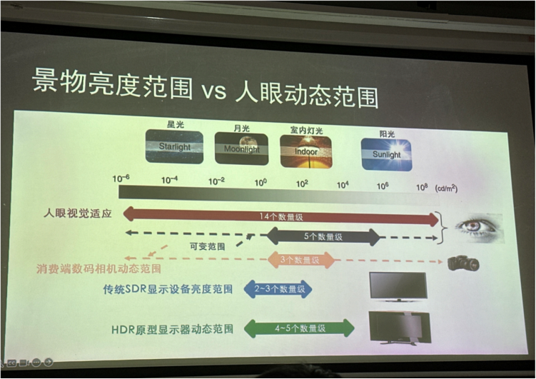

## 16.Raw文件：基本概念

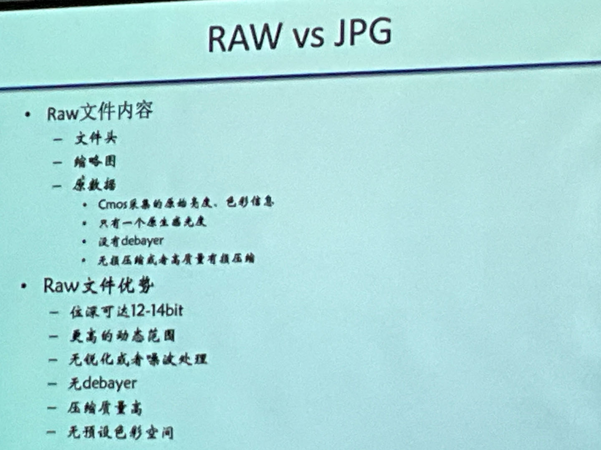

色温：搞清楚各种关系

MTF曲线：会看