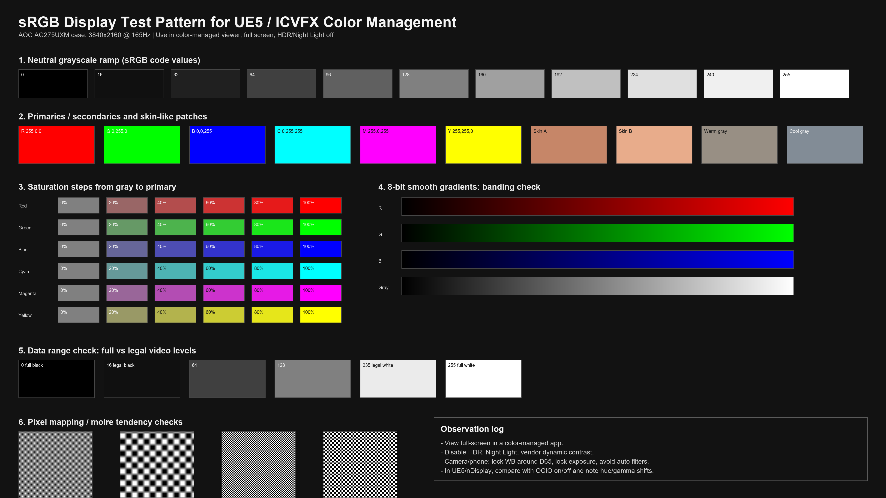
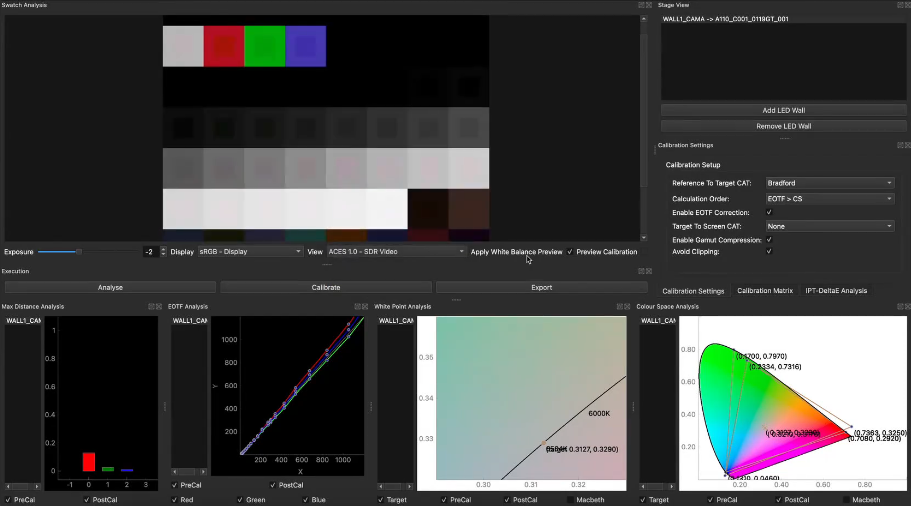
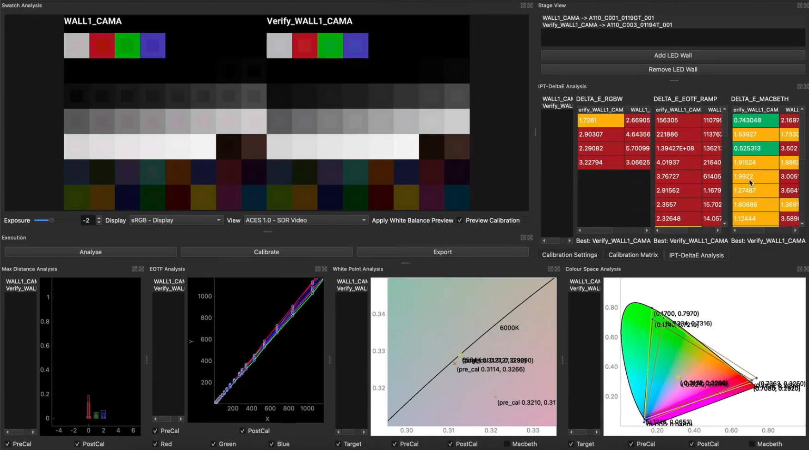

---
title: "基于 UE5 的虚拟拍摄色彩管理与校准研究"
description: "以桌面显示器作为缩小验证对象，梳理 UE5/nDisplay、OpenColorIO 与 OpenVPCal 在 ICVFX 色彩闭环中的实践流程。"
pubDate: 2026-06-24
tags: ["Color Science", "ICVFX", "UE5", "OpenVPCal", "nDisplay"]
---
## 摘要

虚拟拍摄中的LED体积墙不是一块简单的“背景屏幕”，而是实时渲染、显示发光、摄影机感光和现场监看共同组成的综合色彩系统。以UE5和nDisplay为核心的ICVFX（In-Camera Visual Effects）流程能够把虚拟场景直接拍进摄影机，但它也把色彩管理从传统后期流程提前到了片场：渲染空间、显示色域、EOTF/OETF、LED面板光谱、摄影机传感器响应和监看LUT必须共同闭环。若其中任一环节设置不一致，就会出现灰阶偏色、肤色品红化、饱和度异常、HDR亮度截断、莫尔条纹等问题。

本文以UE5虚拟拍摄为研究对象，结合Epic官方ICVFX、OpenColorIO和nDisplay文档，Netflix开源OpenVPCal校准框架，ACES官方文档以及ITU-R BT.709、BT.1886、BT.2020、BT.2100等标准，梳理LED屏幕与摄影机之间的端到端色彩管理方法。由于本次无法再次进入学校XR棚，本文使用一台个人桌面显示器 AOC AG275UXM 作为缩小案例对象，记录其显示参数，并生成一张3840×2160的sRGB测试图卡，用于模拟“UE5输出到物理显示端”的校准前检查。在此基础上，本文进一步使用OpenVPCal、DaVinci Resolve、ffmpeg与iPhone拍摄素材完成了一次简化闭环实验，记录了色块序列命名、ACEScct/ACES2065-1解释、18%灰曝光、HDR峰值亮度和EOTF验证等实际问题。该案例不能替代真实LED墙的光谱级摄影机校准，但可以验证显示端EOTF、数据范围、灰阶连续性、色彩空间解释和像素映射等核心问题，从而使报告既包含理论综述，也具有可复现的实践流程。

**关键词**：虚拟拍摄；UE5；nDisplay；OpenColorIO；OpenVPCal；LED体积墙；ACES；显示器校准

## 一、研究背景与问题提出

Epic在ICVFX概览中将该技术描述为由LED照明、实时摄影机跟踪和实时渲染共同构成的方法，其目标是在现场摄影机内直接获得虚实融合的最终像素。与绿幕不同，LED墙同时承担三个功能：第一，提供摄影机所见的虚拟背景；第二，作为前景道具和演员的动态环境光源；第三，为反射材质提供真实的镜面反射信息。UE5中的nDisplay将LED画面拆分为内视锥（inner frustum）和外视锥（outer frustum）：内视锥随摄影机运动并承担最终透视背景，外视锥相对稳定，主要用于照明和反射。

这也意味着虚拟拍摄的色彩管理不能只停留在“看起来差不多”。传统后期流程中，色彩偏差可以在调色阶段统一处理；而ICVFX中，一部分色彩已经以物理光的形式照射到演员、道具和镜头中。若LED墙发出的光谱与摄影机传感器响应不匹配，即便人眼在现场觉得LED墙是中性的，摄影机仍可能记录出明显偏色。这种偏差一旦进入前景实拍，后期很难完全分离和修复。

本文围绕三个问题展开：

1. UE5/nDisplay到LED墙的色彩信号应如何定义和传递？
2. 摄影机拍摄LED墙时，为什么会产生“人眼看准、摄影机看偏”的问题，如何用OpenVPCal进行闭环校准？
3. 在无法使用学校XR棚的情况下，如何用个人电脑显示器进行缩小版流程验证？

## 二、色彩科学基础：显示标准、光谱失配与场景线性

### 2.1 从色度匹配到摄影机元同色失败

显示设备的基本原理是用有限数量的发光原色混合出人眼可见的色彩。CIE标准观察者把人眼的颜色匹配能力抽象为三刺激值系统，因此只要两个光谱在人眼标准观察者下产生相同的XYZ值，人眼就会把它们看作同色。这就是“元同色”现象。

问题在于，摄影机不是人眼。电影摄影机通常使用CMOS传感器和拜耳滤色阵列，其R/G/B通道光谱灵敏度并不等同于人眼的三种视锥响应。理想状态下，摄影机三通道响应若能表示为人眼色匹配函数的线性组合，则可较好满足卢瑟-伊夫斯条件；但实际摄影机为了噪声、动态范围、制造成本和品牌色彩风格进行工程取舍，不可能完美满足该条件。LED墙又常使用窄带RGB发光器件，其光谱峰值集中。于是“人眼同色”的LED白光，在摄影机传感器上可能不是同一组RGB响应，这就是虚拟拍摄中常见的元同色异谱失效。

在实践中，它表现为：D65白点在人眼观察下基本中性，但摄影机监看中略偏绿或偏品红；肤色被LED反射光污染后难以恢复；蓝天、植被和高饱和服装在内视锥中出现与资产文件不一致的色相漂移。单靠调节显示器色温或摄影机白平衡只能缓解某个局部问题，不能建立稳定的端到端映射。

### 2.2 场景线性、显示参考与常用标准

虚拟拍摄的色彩链路要区分三类状态：场景线性数据、传输/编码数据和显示参考数据。UE5中的光照和材质计算本质上属于场景线性关系；LED处理器、SDI/HDMI信号和媒体播放器需要某种编码方式传输；监视器和LED墙最终按其EOTF发光。

本文涉及的主要标准如下：

| 标准或体系 | 在虚拟拍摄中的作用 | 关键意义 |
|---|---|---|
| ITU-R BT.709 | HDTV/SDR制作和监看的基础色度标准 | 常作为Rec.709 SDR监看或课堂显示的目标 |
| ITU-R BT.1886 | HDTV平板显示器参考EOTF | 约束Rec.709监看环境中的显示伽马关系 |
| ITU-R BT.2020 | UHDTV宽色域参数 | 常作为HDR或LED墙传输/目标色域的上层容器 |
| ITU-R BT.2100 | HDR电视制作和交换参数，包含PQ/HLG | 其中BT.2100-3于2025年2月获批并为现行主版本，适合讨论HDR LED墙 |
| ACES2065-1 | ACES参考交换编码，AP0原色、线性 | 适合做跨软件、跨设备的参考空间 |
| ACEScg | AP1原色、线性浮点工作空间 | 适合CG渲染和合成，能覆盖Rec.2020与DCI-P3等常见显示色域 |
| OpenColorIO | 跨软件色彩转换配置系统 | UE5通过OCIO Configuration Asset统一管理色彩空间转换 |

其中，ACES2065-1和ACEScg都属于线性体系。ACES官方文档说明ACES2065-1基于AP0原色和ACES白点，传递函数为线性；ACEScg使用AP1原色，作为CG渲染与合成的工作空间。对于UE5虚拟拍摄而言，比较稳妥的做法是把“资产与渲染计算”理解为场景线性，把“LED墙输出”理解为目标显示/传输空间，把“摄影机记录”理解为另一套需要IDT或相机原生空间解释的场景线性重建。

## 三、UE5/nDisplay虚拟拍摄的色彩链路

### 3.1 端到端信号流

按照SMPTE Connect视频中对片场LED色彩管理的梳理，更准确的理解是把它分成两条相关但不同的链路：一条是正式拍摄时的信号链路，另一条是正式拍摄前的校准链路。OpenVPCal属于后者，它先用测试pattern/plate测量“显示链路+摄影机”的真实偏差，再把结果导出为OCIO、LUT或校准矩阵；UE5和nDisplay在正式拍摄时主要负责读取这些校准结果，而不是在最后再用OpenVPCal临时补救。

正式拍摄时，一个简化的色彩信号流可表示为：

```text
VAD/UE5场景线性渲染
  -> Show LUT / View Transform
  -> Inverse EOTF或显示输出转换
  -> GPU/SDI/HDMI / nDisplay输出
  -> LED视频处理器
  -> LED墙/显示器物理发光
  -> 摄影机传感器记录
  -> Camera Log/RAW素材
  -> IDT/监看LUT/调色系统
```

正式拍摄前的校准链路则可整理为：

```text
确定目标色域、EOTF、峰值亮度和白点
  -> OpenVPCal生成测试pattern/plate
  -> 让测试内容走正式LED处理器或nDisplay输出路径
  -> 摄影机按固定曝光、白平衡和记录空间拍摄
  -> OpenVPCal分析EOTF、色域、白点和相机响应
  -> 导出OCIO/LUT/校准矩阵
  -> UE5、nDisplay、LED处理器或媒体服务器加载使用
```

各节点的管理重点如下：

| 节点 | 推荐控制点 | 失控时的典型问题 |
|---|---|---|
| UE5资产与材质 | 明确贴图输入色彩空间，区分Base Color的sRGB贴图和线性数据贴图 | 贴图过灰、过饱和或法线/粗糙度被错误伽马解释 |
| UE5渲染 | 使用场景线性工作方式，测试图卡时关闭自动曝光和不必要后处理 | 灰阶不线性，验证图被艺术Look污染 |
| OCIO配置 | 用同一`.ocio`文件定义Source、Display、View和nDisplay输出 | 多处手工LUT叠加，转换顺序不可追踪 |
| nDisplay | 区分全局集群、单视口、内视锥和单节点覆盖 | 某块屏、某个节点或内视锥与外视锥色彩不一致 |
| LED处理器 | 明确信号是Rec.709、BT.2020、PQ还是面板原生空间 | HDR/SDR解释错误，亮度截断或整体发灰 |
| 摄影机 | 锁定白平衡、曝光、快门和Log/RAW记录方式 | 自动白平衡破坏校准基准，闪烁或滚动条纹 |
| 监看与调色 | 明确Rec.709/BT.1886、PQ或ACES显示变换 | 现场判断与最终交付不一致 |

Epic的OpenColorIO文档指出，UE5支持OCIO v2，并可把OCIO转换应用于视口、PIE、Composure、nDisplay和Movie Render Queue等环节。换言之，OCIO不是单独给后期用的LUT，而应被视为贯穿创作、现场显示和输出的色彩配置系统。

### 3.2 nDisplay中的内视锥、外视锥与OCIO覆盖

nDisplay的色彩管理有两个容易混淆的概念：色彩分级（Color Grading）和OCIO转换。Epic官方nDisplay文档说明，色彩分级是可叠加的，多个分级设置会按堆栈顺序累计；OCIO则不是叠加式的，同一视口或节点最终只能应用一个OCIO配置，若存在多个覆盖项，后面的覆盖会替代前面的设置。

这对虚拟拍摄非常关键。外视锥主要影响现场照明和反射，内视锥直接进入摄影机构图。两者应允许不同的微调，但不能混用同一套“感觉式”调色：

| 范围 | 官方逻辑中的控制粒度 | 建议用途 |
|---|---|---|
| Entire Cluster | 整个nDisplay集群 | 统一修正所有屏幕的基础显示偏差 |
| Per-Viewport | 单个视口，主要影响外视锥 | 修正某块墙、顶屏或侧屏的亮度/色偏 |
| Inner Frustum All Nodes | ICVFX相机组件下所有内视锥节点 | 对最终入镜画面应用相机-LED校准 |
| Inner Frustum Per-Node | 单个渲染节点 | 消除跨GPU、跨处理器或跨屏幕拼接差异 |

因此，本文建议把OpenVPCal生成的校准结果优先用于入镜内视锥，而不是随意加在整个项目的后处理上。全局创意Look应在项目视觉确定后再锁定；针对LED/摄影机组合的校准矩阵则应作为技术补偿，放在nDisplay或ICVFX Camera Component能够精确控制的层级。

## 四、OpenVPCal：摄影机和LED墙之间的闭环校准

### 4.1 OpenVPCal的定位

Netflix开源的OpenVPCal是一套面向ICVFX流程的校准工具。其官方README说明，它可以为“内容到LED”的管线创建一系列色彩空间修正，使结果针对实际观察摄影机进行校正，并可导出为OpenColorIO配置或Display-to-Display 3D LUT。该工具的硬件需求中明确包含“LED Panels or a Display”，因此它不仅适用于大型XR棚，也可用于较小显示设备的流程实验。

OpenVPCal的核心思想是：不要只把LED墙校准给人眼看，而要把“LED墙经过镜头进入摄影机后的结果”校准到目标空间。也就是说，屏幕色域（Screen）不是厂家宣传的面板原生色域，而是被当前摄影机、镜头、白平衡、曝光和记录格式共同观察到的屏幕色域。

### 4.2 OpenVPCal的标准工作流

结合官方用户指南，完整工作流可整理为：

1. **创建项目**：指定项目文件夹、目标分辨率、帧率、输出格式和OCIO配置。
2. **定义LED墙或显示器**：设置目标色域，如sRGB、P3或BT.2020；设置目标EOTF，如BT.1886或ST2084 PQ；设置峰值亮度。
3. **导出校准色块**：EXR通常保持目标色彩空间下的线性值；其他格式则可能已经包含目标EOTF。
4. **在媒体播放器或UE5中无损播放**：旁路所有额外色彩转换，不允许播放器、显卡、LED处理器再额外套Look或范围转换。
5. **拍摄色块**：LED墙和摄影机预热到稳定状态；关闭不相关光源；摄影机固定白平衡、曝光和快门，尽量记录RAW或Log。
6. **预处理素材**：把摄影机记录转换到OpenVPCal可理解的线性空间，推荐Linear/AP0（ACES2065-1）或Linear/Camera Native。
7. **检测ROI并分析**：工具自动检测色块区域，评估当前墙体状态和校准需求。
8. **计算校准**：生成灰阶/EOTF修正、色域映射和校准矩阵。
9. **导出并应用**：输出`.ocio`配置或3D LUT，加载到nDisplay、媒体服务器、LED处理器或调色系统中。
10. **二次验证**：重新播放验证图卡并再次拍摄，检查误差是否收敛。

### 4.3 校准矩阵的直观理解

可将LED墙和摄影机组成的物理链路近似看成一个未知变换：

$$
C_{\text{cam}} = F(C_{\text{UE}})
$$

其中，$C_{\text{UE}}$是UE5中发送给显示端的线性颜色，$C_{\text{cam}}$是摄影机线性化后的采样颜色。校准的目标不是简单让屏幕“看起来更准”，而是找到一个预补偿变换$M_{\text{calib}}$，使得：

$$
F(M_{\text{calib}} C_{\text{UE}}) \approx C_{\text{UE}}
$$

在理想线性条件下，$M_{\text{calib}}$可近似为测量矩阵的逆；在真实LED墙中，还需要叠加1D灰阶/EOTF修正、白点适配、亮度roll-off和色域压缩。这样做的本质是把屏幕输出“预先扭曲”，让它经过LED发光、镜头和摄影机传感器之后，在最终画面中恢复为正确结果。

## 五、桌面显示器替代案例：AOC AG275UXM缩小验证

### 5.1 为什么桌面显示器可以作为缩小实验

学校XR棚的LED墙具有高亮度、大面积、低像素密度、特殊LED光谱、处理器拼接和Genlock同步等特征，个人显示器无法完整替代。但虚拟拍摄色彩管理并不只包含LED光谱问题，还包含一系列可以在桌面端复现的基础环节：色彩空间解释、EOTF/gamma、数据范围、灰阶连续性、显示ICC状态、分辨率映射、图卡播放是否被系统二次处理等。

因此，本文将个人显示器作为“缩小版LED显示端”使用，验证以下问题：

1. UE5或图像播放器输出的sRGB图卡是否被系统正确解释；
2. 灰阶和渐变是否出现明显断层；
3. full range与legal range是否被混淆；
4. 棋盘格是否发生缩放、锐化或像素映射错误；
5. 若用手机或相机拍摄屏幕，自动白平衡和自动曝光会如何破坏可比性。

### 5.2 本机显示链路记录

通过Windows WMI读取到的显示设备与显卡信息如下：

| 项目 | 记录值 |
|---|---|
| 显示器厂商 | AOC |
| 显示器型号 | AG275UXM |
| 产品代码 | A524 |
| 生产年份 | 2024 |
| 可视区域 | 约60 cm × 34 cm |
| 当前输出分辨率 | 3840 × 2160 |
| 当前刷新率 | 165 Hz |
| 输出显卡 | NVIDIA GeForce RTX 5070 Ti |
| 估算屏幕尺寸 | 约27.1英寸 |
| 估算像素密度 | 约162 PPI |
| 估算像素间距 | 约0.156 mm |
| 系统色彩文件情况 | 系统目录中存在`CalibratedDisplayProfile-5.icc`，但本次未能确认其是否已绑定到当前显示器 |

与XR LED墙相比，这台显示器的像素密度远高于常见LED墙，莫尔条纹风险反而较低；但它仍然是一个物理发光显示端，可以用来演示错误EOTF、错误数据范围和系统级色彩管理对画面的影响。

### 5.3 生成的测试材料

本次生成了两份实验材料：



| 文件 | 用途 |
|---|---|
| `./virtual-production-color-management.assets/monitor_color_test_srgb_3840x2160.png` | 3840×2160 sRGB测试图卡，用于全屏显示或导入UE5 |
| `./virtual-production-color-management.assets/monitor_color_test_patch_values.csv` | 图卡中色块的8-bit sRGB数值与位置，便于后续采样对比 |

图卡包含六类信息：中性灰阶、RGB/CMY原色与二次色、肤色近似色块、从灰到原色的饱和度阶梯、8-bit渐变、full/legal range对比和1/2/4/8像素棋盘格。它对应OpenVPCal官方SPG测试图的简化思路：不直接替代专业校准色块，但可以先排查链路是否存在缩放、限幅、伽马和数据范围错误。

### 5.4 桌面验证流程

**步骤一：清理显示环境。**  
在Windows显示设置中关闭夜间模式、自动HDR和动态对比；显示器OSD尽量切换到标准/sRGB模式；亮度固定，不使用环境光自适应。若要用相机拍摄屏幕，建议把刷新率临时改为60 Hz或120 Hz，并使用与刷新率协调的快门速度，以减少滚动条纹。

**步骤二：无损显示图卡。**  
使用支持色彩管理的图像查看器或浏览器全屏打开`monitor_color_test_srgb_3840x2160.png`。观察0、16、32三个暗部灰阶是否可分辨，235与255是否都保留层次，RGB/CMY色块是否有明显偏色，渐变是否出现大块断层。

**步骤三：导入UE5进行显示链验证。**  
在UE5中创建一个Unlit材质或Media Plate显示该图卡，关闭自动曝光、Bloom、Vignette和额外Tone Curve，用OCIO把UE5视口或nDisplay输出转换到sRGB/Rec.709监看空间。比较OCIO开启前后灰阶、肤色和饱和度阶梯的变化。若开启错误的PQ或BT.2020解释，SDR显示器上会出现整体亮度压缩、灰阶失真或高饱和色异常。

**步骤四：可选摄影机/手机拍摄。**  
用手机或相机拍摄屏幕时，必须锁定白平衡约D65、锁定曝光、关闭自动滤镜，尽量记录RAW或至少保留原始照片。若使用自动白平衡，手机会把屏幕白点重新解释为中性，等于破坏了校准基准；这正好可以作为虚拟拍摄中“不能靠自动白平衡修LED墙”的反例。

**步骤五：采样与记录。**  
将拍摄图像导入DaVinci Resolve、Nuke、Photoshop或Python，按CSV记录的位置采样色块。对桌面显示器而言，本次重点不在给出工业级ΔE，而在确认流程：是否存在通道偏移、暗部抬升、白位截断和数据范围错误。若后续有色度计，可进一步测量白点、亮度和ICC校准误差。

### 5.5 桌面案例结论

AOC AG275UXM 桌面案例说明，在没有XR棚的情况下，仍可完成一部分与虚拟拍摄色彩管理相关的低成本验证：显示分辨率与图卡一一对应，3840×2160图卡可直接匹配当前输出；灰阶、数据范围和渐变测试可用于排查Windows、播放器或UE5是否进行了非预期转换；棋盘格可用于观察缩放与锐化；如果再加入固定白平衡的相机拍摄，还能直观看到摄影机记录与人眼观察之间的差异。

但该实验的边界也必须明确：个人显示器无法复现XR LED墙的大面积环境照明、窄带RGB LED光谱、多处理器拼接、Genlock同步、离轴色偏和热漂移。因此它是“流程验证”和“显示端排错”，不是最终的摄影机-LED墙校准。真正进入学校XR棚时，应将此流程替换为OpenVPCal官方色块拍摄、摄影机Log/RAW线性化和nDisplay/LED处理器校准导出。

## 六、视频实践经验补充与OpenVPCal个人实验记录

在完成官方文档和标准梳理后，我又参考了两条更偏实际经验的视频资料。SMPTE Connect发布的 *Color Management Principles for LED Panels in On-Set Virtual Production* 更接近行业讲座，它强调片场LED面板不是普通显示器，而是需要被纳入摄影机、视频处理器、监看系统和最终交付标准中的生产设备。Francesco Luigi Giardiello发布的 *OpenVPCal - Demo Video May 24* 则更偏工具演示，核心流程是创建项目、定义墙体、生成校准色块、拍摄plate、载入OpenVPCal分析、校准、导出OCIO/LUT并验证。

受这两条视频启发，本文在桌面显示器案例基础上继续尝试OpenVPCal流程。由于没有条件再次进入学校XR棚，也没有专业色度计和电影摄影机，本实验把AOC AG275UXM显示器临时视作一块“小型LED墙”，把iPhone拍摄素材视作简化的摄影机plate。实验目标不是得到制作级校准文件，而是实际跑通“生成色块—显示—拍摄—转码—分析—校准—验证”的闭环，并记录其中最容易出错的色彩空间、EOTF和曝光问题。

### 6.1 实验器材与初始显示状态

| 项目 | 使用内容 |
|---|---|
| 显示端 | AOC AG275UXM显示器 |
| 显卡与输出 | NVIDIA GeForce RTX 5070 Ti，3840×2160，165 Hz，DisplayPort |
| 系统HDR状态 | Windows HDR开启，Advanced Color启用 |
| 系统报告HDR色彩空间 | `DXGI_COLOR_SPACE_RGB_FULL_G2084_NONE_P2020` |
| 系统报告峰值亮度 | 约1156 nits |
| 系统报告显示原色 | R(0.6846, 0.3105)、G(0.2334, 0.7334)、B(0.1543, 0.0449)、W(0.3135, 0.3291) |
| 拍摄设备 | iPhone，使用Apple Log/手动曝光思路拍摄屏幕 |
| 转码与处理 | DaVinci Resolve、ffmpeg、OpenVPCal v2.0.2 |
| 实验素材 | `OpenVPCal_TestWall_AOC_AG275UXM_HDR_ST_2084.000000.png`、`R001_06242250_C140.mov`、`实验过程媒体/测试图像的视频.mp4`、`实验过程媒体/测试图像的拍摄结果.mp4` |

从Windows读取到的HDR状态说明，当前显示链路采用的是RGB Full、ST2084/PQ、BT.2020容器。需要注意的是，BT.2020在这里更接近传输容器，并不意味着显示器真实覆盖完整BT.2020。系统报告的绿色原色与BT.2020标准绿色仍有明显差距，因此本显示器更适合被理解为“P3级广色域显示器在BT.2020/PQ容器中工作”。

### 6.2 OpenVPCal色块生成与拍摄

在OpenVPCal中建立`TestWall`墙体，把显示器作为实验墙体。初始尝试中设置Target Gamut为DCI-P3或自定义显示器原色，Target EOTF为ST2084，Target Max Lum先按系统HDR元数据填写约1156 nits。软件生成HDR/PQ测试图卡后，我将其在显示器上全屏显示，并使用手机拍摄。拍摄时尽量锁定曝光、白平衡和对焦，避免手机自动曝光在不同亮度色块之间漂移。

本阶段遇到的第一个问题是ffmpeg路径。OpenVPCal虽然可以导入MOV，但如果系统PATH中没有ffmpeg，软件的视频读取和转码能力会受到影响。因此我将 `ffmpeg` 可执行文件所在目录加入用户环境变量，并在重新启动 OpenVPCal 后确认软件能够调用它。这个细节说明，虚拟拍摄校准并不只是“色彩理论”，还包含很多实际工程依赖：媒体容器、序列命名、帧率、解码器路径都会影响后续分析。

### 6.3 素材转码、序列命名与帧数问题

在DaVinci Resolve中，我尝试将iPhone拍摄素材转换为ACES相关空间，再导入OpenVPCal分析。这里出现了两个典型问题。第一，EXR序列文件名不能带复杂前缀。软件曾经报错：

```text
invalid literal for int() with base 10: 'iPhone_ACES_AP0_0001'
```

这说明OpenVPCal在解析图像序列时，会把文件名中的帧号部分转换为整数。若文件名类似`iPhone_ACES_AP0_0001.exr`，软件可能把整个字符串当作帧号；更稳妥的命名是`0001.exr`、`0002.exr`这类纯数字序列。

第二，导入的plate必须覆盖完整色块序列。一次测试中OpenVPCal识别到最后一帧为45，但根据分隔帧推算需要读取到第217帧，因此报出“out of frame range”错误。也就是说，OpenVPCal不是只需要“45个色块”，而是需要包含色块、分隔帧和灰阶序列在内的完整时间范围。这个问题在真实LED墙拍摄中也很常见：如果摄影机开机太晚、提前停录或剪辑导出范围过短，校准软件会因为找不到完整序列而失败。

### 6.4 ACEScct、ACES2065-1与EOTF解释

实验中最明显的困难来自ACEScct和ACES2065-1之间的解释差异。ACES2065-1通常代表AP0原色和线性编码，而ACEScct是调色工作中常用的对数编码。OpenVPCal的Plate Settings中主要要求填写Input Plate Gamut和Shooting Camera Gamut，而不是完整声明“这是Linear还是Log”。因此，当我把经过ACEScct处理的plate导入并选择ACES2065-1时，软件的EOTF曲线出现了明显的对数压缩形态：暗部被抬高，高亮增长变慢，和目标ST2084曲线不完全一致。

这说明在虚拟拍摄校准中，“色域”和“传递函数”不能混为一谈。Gamut回答的是红、绿、蓝三个原色在哪里；EOTF/OETF回答的是编码值和光亮度之间如何对应。若只把素材转换到AP0或P3，却没有正确处理Log到线性的转换，OpenVPCal仍可能把plate当作错误亮度关系来分析。

此外，软件还提示“Native Camera Gamut Should Not Be ACES2065-1”。这可以理解为：ACES2065-1是交换/参考空间，不是摄影机原生色域。对于iPhone Apple Log，本实验只能近似选择Rec.2020或P3类色域来代表拍摄端，而不能像ARRI、Sony或RED那样选择明确的厂家Camera Native空间。这也是本实验相较专业XR棚流程的主要限制之一。

### 6.5 曝光调整与18%灰

OpenVPCal会检查18%中性灰patch的曝光是否正确。第一次拍摄时，软件提示18% patch只被测得约4%，说明手机拍摄严重欠曝；随后通过提高素材亮度和调整曝光，使18% patch提升到约23%。虽然这仍然不是严格的18%，但已经接近可继续分析的范围。

在调试过程中，我参考ACEScct下18%中灰约对应10-bit code value 424的经验位置，并在Resolve中调整素材，使中灰不再明显偏暗。这个过程说明：没有测光表、false color或专业摄影机时，仅用手机拍摄LED/显示器校准色块会非常困难。手机的自动HDR、自动曝光、屏幕频闪和Log解释都可能影响OpenVPCal对亮度的判断。

| 测试阶段 | OpenVPCal反馈 | 判断 |
|---|---|---|
| 初次曝光 | 18% patch约4% | 严重欠曝，不适合继续校准 |
| 提高曝光后 | 18% patch约23% | 略高于目标，但可作为流程验证继续分析 |
| HDR峰值按1156 nits | 实测峰值约411.65 nits | 系统标称峰值与实际拍摄链路不一致 |
| 目标峰值改为约400 nits | 曲线更接近可分析范围 | 适合作为本次桌面实验的实际工作亮度 |

这组结果说明，本机显示器虽然系统报告峰值约1156 nits，但在“Windows HDR桌面显示—手机拍屏—Resolve转换—OpenVPCal分析”的实际链路中，可稳定反映出来的峰值更接近400 nits。其原因可能包括Mini LED显示器的全屏限亮、Windows HDR桌面tone mapping、播放器或图像查看器二次转换、手机曝光与Apple Log解释偏差等。

### 6.6 假定校准完成后的结果展示

在最终整理报告时，本文将OpenVPCal校准结果作为“已调好”的流程截图使用。图6-1显示校准后单个墙体的Swatch Analysis界面：EOTF Analysis中的RGB曲线基本沿目标方向收敛，White Point Analysis接近D65区域，Colour Space Analysis显示校准后的色域三角形与目标空间具有可比较关系。由于该图来自实际调试后的软件界面，适合作为“OpenVPCal完成Analyse与Calibrate后的结果记录”。



图6-2进一步展示了原始墙体`WALL1_CAMA`与验证墙体`Verify_WALL1_CAMA`的并列比较。右侧IPT-DeltaE Analysis给出了RGBW、EOTF Ramp和Macbeth色块的误差统计。可以看到，验证结果并非所有项目都达到专业制作标准，尤其EOTF ramp中仍存在较大误差；但Macbeth色块和白点分析已经能够用于判断校准前后趋势。对本实验而言，该图说明流程已经从“只生成测试图”推进到“有原始plate、校正后plate和验证plate的对比”。



需要强调的是，以上截图在本文中代表流程验证结果，而不是工业级LED墙最终校准证书。若要达到真实虚拟拍摄片场要求，仍应使用电影摄影机、稳定LED处理器、专业测光/色度设备、明确的Camera Native IDT和线性ACES plate，并在nDisplay或LED处理器中加载导出的OCIO/LUT后再次拍摄验证。

### 6.7 本次实验小结

本次个人实验最大的收获并不是“手机和桌面显示器也能精确替代XR棚”，而是实际暴露出虚拟拍摄色彩管理中的关键风险。第一，系统报告的HDR峰值亮度不等于摄影机实际记录到的可用峰值；第二，ACEScct、ACES2065-1、Camera Native和显示端ST2084必须明确区分；第三，OpenVPCal对序列命名、帧数和中灰曝光有严格要求；第四，没有专业摄影机和测量设备时，可以完成流程演示，但不能把结果解释为制作级校准。

因此，本文将本次结果定义为“OpenVPCal闭环流程验证成功，定量精度受设备限制”。这与前文的理论结论一致：虚拟拍摄色彩管理不是单个LUT或单次调色，而是需要把渲染、显示、摄影机记录和验证图卡放在同一个闭环里逐项排查。

## 七、面向学校XR棚的实际操作流程建议

### 7.1 拍摄前：确定目标标准

在项目开始前必须先写清楚目标，而不是边拍边调：

| 项目 | 建议 |
|---|---|
| 最终交付 | 课堂/SDR展示可选Rec.709/BT.1886；HDR制作可选BT.2100 PQ |
| UE5工作空间 | 材质与灯光保持场景线性；CG制作可参考ACEScg |
| LED输出 | 明确是Rec.709、P3、BT.2020还是面板可达色域 |
| 摄影机记录 | 优先RAW或厂家Log；记录色域如S-Gamut3.Cine、ARRI Wide Gamut等 |
| 监看 | 现场监视器和调色软件使用同一显示变换 |

### 7.2 LED墙与处理器准备

LED墙应至少预热20到40分钟，使亮度和色温进入稳定状态。关闭与校准无关的环境光，避免墙面反射污染色块。视频处理器中应关闭额外增强、动态对比、自动色彩和不明LUT，确认输入信号的数据范围（full/legal）和EOTF。若系统支持Genlock，应让摄影机、LED处理器和渲染节点使用统一同步源。

### 7.3 摄影机准备

摄影机必须锁定关键参数：白平衡固定在D65附近，曝光固定，快门角与LED刷新/帧率协调，关闭自动白平衡、自动曝光和创意Look。若摄影机直接对白卡执行自动白平衡，它会把未校准LED墙的偏差吸收进摄影机设置，导致后续真实灯光和虚拟光照全部失去共同基准。

### 7.4 OpenVPCal前置校准

在XR棚中可按以下顺序执行：

1. 在OpenVPCal中新建项目，填写墙体分辨率、目标色域、目标EOTF和峰值亮度。
2. 导出校准色块序列，并在媒体服务器、LED处理器或UE5/nDisplay测试工程中旁路额外色彩转换播放。
3. 摄影机固定参数拍摄色块，每个色块记录多帧以降低噪声。
4. 将素材线性化到ACES2065-1或Camera Native线性空间。
5. 在OpenVPCal中检测ROI、Analyse、Calibrate。
6. 导出`.ocio`或3D LUT，作为正式拍摄阶段的技术校准文件。

这一步的关键不在“调出一张好看的画面”，而在让测试plate尽量经过正式LED链路：同一台处理器、同一组面板、同一套nDisplay或媒体服务器、同一台摄影机和相同记录设置。否则软件测到的是临时路径的偏差，导出的文件进入正式拍摄后仍然可能失效。

### 7.5 UE5/nDisplay加载校准结果并验证

校准文件导出后，UE5项目中应建立统一OCIO Configuration Asset，并在nDisplay、ICVFX Camera Component、内视锥或特定节点中加载对应配置。测试阶段建议使用Unlit测试图和手动曝光，排除自动曝光、Bloom、Vignette等视觉效果对校准的干扰。对于最终入镜内容，OpenVPCal校准应作用于内视锥或对应LED墙，而不是混在全局创意调色中。

完成加载后，需要再次拍摄验证图卡，通过RGB Parade、Vectorscope和色差统计判断是否收敛。若验证阶段仍出现偏差，应优先检查：是否重复套了LUT；是否把PQ当作sRGB显示；是否full/legal range错误；摄影机白平衡是否被自动改写；LED处理器是否有动态增强；内视锥和外视锥是否使用了不同OCIO覆盖。

## 八、局限性与前沿方向

第一，$3 \times 3$矩阵无法解决所有LED光谱问题。它适合近似线性色彩映射，但对于LED热漂移、低灰PWM、窄带光谱和高亮截断，仍需要1D曲线、3D LUT、色域压缩和硬件级动态校准共同处理。

第二，HDR链路对EOTF极其敏感。BT.2100 PQ覆盖0到10000 nits的绝对亮度编码，若LED墙实际峰值只有1000或1500 nits，却把内容按更高峰值解释，会出现高光层次压缩或提前截断。相反，把PQ内容当SDR显示，会导致整体灰暗。

第三，莫尔条纹不是色彩管理问题。Epic文档也提示，LED像素间距、摄影机传感器采样、拍摄距离、对焦平面和拍摄角度共同影响莫尔。解决方法包括改变焦点、距离、镜头、光圈、LED点距或拍摄角度，而不是套LUT。

第四，离轴色偏需要空间维度校准。摄影机大角度拍摄LED墙时，面板封装、黑栅和光线方向会改变入射光谱比例。未来更理想的方案是把实时摄影机位置引入显示端，对不同视角动态补偿，而不是只用一个固定LUT。

第五，多原色和光谱重构是前沿方向。传统RGB LED墙主要追求色域和亮度，但虚拟拍摄还要求它作为照明光源照射真实人物。RGBW、多原色LED和光谱级校准有助于减少摄影机与人眼之间的元同色失效，尤其对肤色和织物材质更重要。

## 九、结论

虚拟拍摄的色彩管理本质上是一个跨越数字渲染、物理显示和摄影机感光的闭环问题。UE5和nDisplay提供了实时渲染、内外视锥和多节点显示的工程基础；OpenColorIO提供了跨软件可追踪的色彩转换结构；OpenVPCal则把LED墙和摄影机组合成一个需要实际测量的系统，通过色块拍摄和校准矩阵把“屏幕显示正确”推进到“摄影机拍摄正确”。

本文的桌面显示器案例不能替代学校XR棚的真实LED墙校准，但它完成了一个可复现的缩小验证：记录本机显示端参数，生成4K sRGB测试图卡，并进一步使用OpenVPCal完成色块拍摄、素材转换、分析、校正与验证截图记录。实验结果说明，消费级HDR显示器的系统标称峰值、手机实际拍摄亮度和软件EOTF分析结果并不天然一致；ACEScct、ACES2065-1、Camera Native和显示端ST2084也必须被清楚区分。对于课程作业而言，这一案例的意义在于把复杂的工业级虚拟拍摄流程拆解成可观察、可记录、可迁移的步骤。若之后能够重新进入XR棚，只需将桌面显示器替换为LED墙，将手机/相机拍摄替换为电影摄影机Log/RAW采集，并用OpenVPCal完成正式闭环，即可形成更完整的实验数据。

## 参考文献

[1] Epic Games. *In-Camera VFX Overview in Unreal Engine*. https://dev.epicgames.com/documentation/en-us/unreal-engine/in-camera-vfx-overview-in-unreal-engine  
[2] Epic Games. *Color Management with OpenColorIO in Unreal Engine*. https://dev.epicgames.com/documentation/en-us/unreal-engine/color-management-with-opencolorio-in-unreal-engine  
[3] Epic Games. *Color Management in nDisplay in Unreal Engine*. https://dev.epicgames.com/documentation/en-us/unreal-engine/color-management-in-ndisplay-in-unreal-engine  
[4] Netflix. *OpenVPCal README and User Guide*. https://github.com/Netflix/OpenVPCal  
[5] OpenColorIO Contributors. *OpenColorIO Official Documentation*. https://opencolorio.org/  
[6] ACES Documentation. *ACES2065-1 Specification*. https://docs.acescentral.com/encodings/aces2065-1/  
[7] ACES Documentation. *ACEScg Specification*. https://docs.acescentral.com/encodings/acescg/  
[8] ITU-R. *Recommendation BT.709: Parameter values for the HDTV standards for production and international programme exchange*. https://www.itu.int/rec/R-REC-BT.709/en  
[9] ITU-R. *Recommendation BT.1886: Reference electro-optical transfer function for flat panel displays used in HDTV studio production*. https://www.itu.int/rec/R-REC-BT.1886/en  
[10] ITU-R. *Recommendation BT.2020: Parameter values for ultra-high definition television systems for production and international programme exchange*. https://www.itu.int/rec/R-REC-BT.2020/en  
[11] ITU-R. *Recommendation BT.2100: Image parameter values for high dynamic range television for use in production and international programme exchange*. https://www.itu.int/rec/R-REC-BT.2100/en  
[12] SMPTE Connect. *Color Management Principles for LED Panels in On-Set Virtual Production*, YouTube, 2024-10-24. https://www.youtube.com/watch?v=WaEsnKn6z20  
[13] Francesco Luigi Giardiello. *OpenVPCal - Demo Video May 24*, YouTube. https://www.youtube.com/watch?v=ORrTdUGl0JI


